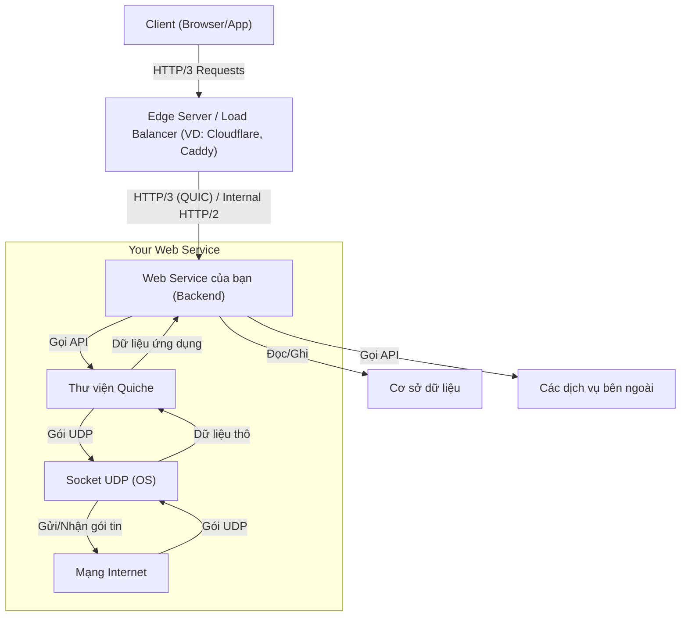

# Weekly Technology Intelligence Report (2026-39)

Generated: Sat, 26 Sep 2026 07:16:42 GMT

## 🏷️ Key Topics & Tags

`AI`  `SOFTWARE DEVELOPMENT`  `SECURITY`  `DATABASES`  `OPEN SOURCE`  `CLOUD`  `PERFORMANCE`

## 🤖 AI Trend Analysis

# 📊 Tổng Quan

Hôm nay, các xu hướng công nghệ nổi bật nhất xoay quanh sự phát triển mạnh mẽ của AI Agent, đặc biệt là các công cụ hỗ trợ lập trình, cùng với sự tiếp tục hoàn thiện của các công nghệ hạ tầng mạng cốt lõi.

## Top 5 công nghệ hoặc dự án đáng chú ý nhất hôm nay

1.  **`pytorch / pytorch`** (Score: 103337): Một thư viện học sâu (deep learning) mã nguồn mở hàng đầu, cung cấp khả năng tính toán tensor và xây dựng mạng neural động với tăng tốc GPU mạnh mẽ, là nền tảng cho nhiều ứng dụng AI hiện đại.
2.  **`anthropics / claude-code`** (Score: 148135): Một công cụ lập trình dạng agent từ Anthropic, hoạt động trong terminal, hiểu codebase và hỗ trợ thực thi các tác vụ thường ngày, giải thích mã, xử lý workflow Git bằng ngôn ngữ tự nhiên.
3.  **`bojieli / ai-agent-book`** (Score: 51052): Kho lưu trữ mã nguồn mở của cuốn sách "Sâu sắc về AI Agent: Nguyên lý thiết kế và Thực hành kỹ thuật", cung cấp tài liệu học tập toàn diện về lĩnh vực AI Agent.
4.  **`paperclipai / paperclip`** (Score: 85475): Ứng dụng mã nguồn mở được sử dụng để quản lý các AI Agent trong công việc, cho thấy nhu cầu về công cụ tổ chức và điều phối các tác nhân AI.
5.  **`cloudflare / quiche`** (Score: 12615): Một triển khai của Cloudflare cho giao thức vận chuyển QUIC và HTTP/3, đại diện cho những cải tiến quan trọng trong công nghệ mạng nhằm tăng tốc độ và hiệu quả truyền dữ liệu trên Internet.

## Vì sao chúng đang nổi lên

*   **AI Agent:** Sự bùng nổ của các mô hình ngôn ngữ lớn (LLM) đã dẫn đến làn sóng phát triển các AI Agent – hệ thống AI có khả năng lập kế hoạch, sử dụng công cụ và tương tác với môi trường để hoàn thành các tác vụ phức tạp. Các dự án như `claude-code`, `paperclip`, `cline`, `OpenSpec`, `Octop`, `WeKnora`, `orca`, `agent-skills`, `ECC`, `open-code-review`, `security-audit-skill` đều thể hiện sự tập trung cao độ vào việc xây dựng, quản lý và tối ưu hóa các agent này, đặc biệt trong lĩnh vực lập trình và năng suất làm việc. Cuốn sách `ai-agent-book` cũng chứng minh nhu cầu lớn về kiến thức nền tảng trong lĩnh vực này.
*   **Hạ tầng mạng thế hệ mới:** `cloudflare / quiche` nổi lên khi thế giới web tiếp tục tìm cách tối ưu hóa hiệu suất. QUIC và HTTP/3 là những giao thức cốt lõi giúp giảm độ trễ và cải thiện trải nghiệm người dùng, đặc biệt quan trọng cho các ứng dụng đám mây và dịch vụ truyền phát.
*   **Nền tảng học máy:** `pytorch` là một công cụ không thể thiếu cho các nhà phát triển AI, liên tục được cải tiến và duy trì vị thế là một trong những thư viện ML phổ biến nhất.

## Ai nên quan tâm

*   **Kỹ sư Backend & SRE:** Cần hiểu về AI Agent để chuẩn bị cho sự thay đổi trong quy trình phát triển và vận hành, cũng như tận dụng chúng để tự động hóa. Kiến thức về QUIC/HTTP/3 là bắt buộc để tối ưu hiệu suất dịch vụ.
*   **Kỹ sư Cloud & DevOps:** AI Agent có tiềm năng lớn trong tự động hóa CI/CD, quản lý hạ tầng. Các công cụ quản lý agent (`paperclip`, `orca`) sẽ trở thành một phần của hệ sinh thái DevOps.
*   **Những người học System Design:** AI Agent giới thiệu một mô hình kiến trúc mới với khả năng ra quyết định và tương tác tự động. QUIC/HTTP/3 là ví dụ điển hình về tối ưu hóa giao thức ở tầng thấp ảnh hưởng lớn đến thiết kế hệ thống phân tán.

## Dự án được chọn để phân tích chuyên sâu

Tôi sẽ chọn hai dự án sau để phân tích chuyên sâu:

1.  **`anthropics / claude-code`**: Bởi vì nó đại diện cho xu hướng AI Agent đang thống trị, có tác động trực tiếp đến năng suất của kỹ sư và quy trình phát triển phần mềm. Nó cung cấp một cái nhìn cụ thể về cách AI Agent có thể tích hợp vào công việc hàng ngày của backend engineer.
2.  **`cloudflare / quiche`**: Bởi vì đây là một công nghệ hạ tầng cốt lõi, trực tiếp liên quan đến hiệu suất mạng và tính ổn định của các hệ thống phân tán. Nó cung cấp kiến thức nền tảng quan trọng cho kỹ sư backend và SRE, không liên quan đến AI, giúp cân bằng báo cáo.

---

# 🔥 Phân Tích Chuyên Sâu

## Claude Code (anthropics / claude-code)

### Mô tả

Claude Code là một công cụ lập trình dạng agent, chạy ngay trong terminal của bạn. Nó được thiết kế để hiểu toàn bộ codebase của dự án, từ đó giúp bạn lập trình nhanh hơn bằng cách tự động thực hiện các tác vụ lặp đi lặp lại, giải thích các đoạn mã phức tạp, và hỗ trợ các quy trình làm việc với Git — tất cả thông qua các lệnh ngôn ngữ tự nhiên.

### URL

`https://github.com/anthropics/claude-code`

### Tại sao đang nổi bật

Claude Code đang nổi bật với điểm số sao rất cao trên GitHub (148135), cho thấy sự quan tâm lớn từ cộng đồng. Nó đến từ Anthropic, một trong những công ty hàng đầu trong lĩnh vực AI, mang lại sự tin cậy và kỳ vọng về chất lượng. Công cụ này đại diện cho một xu hướng mạnh mẽ về "AI Coding Agents" — các trợ lý AI có khả năng không chỉ tạo mã mà còn tương tác sâu với môi trường phát triển để thực hiện các tác vụ kỹ thuật phức tạp, cải thiện năng suất của lập trình viên. Sự tiện lợi của việc sử dụng ngôn ngữ tự nhiên để tương tác với codebase là một yếu tố hấp dẫn lớn.

### Nguyên lý cơ bản

Nguyên lý cốt lõi đằng sau Claude Code là mô hình **AI Agent** được trang bị khả năng **lập kế hoạch (planning)**, **sử dụng công cụ (tool-use)** và **quản lý ngữ cảnh (context management)**.
*   **Vấn đề giải quyết:** Các tác vụ lập trình lặp lại, tốn thời gian (boilerplate, refactoring đơn giản, tìm kiếm thông tin trong codebase), và việc hiểu các đoạn mã phức tạp hoặc quy trình Git.
*   **Cách tiếp cận khác biệt:** Thay vì chỉ là một chatbot trả lời câu hỏi, Claude Code hoạt động như một "tác nhân" tự động trong môi trường phát triển của bạn. Nó sử dụng một Mô hình Ngôn ngữ Lớn (LLM) làm bộ não, nhưng quan trọng hơn là nó có thể:
    1.  **Đọc và hiểu ngữ cảnh:** Duy trì nhận thức về trạng thái hiện tại của codebase, các tệp mở, thay đổi Git, lịch sử trò chuyện.
    2.  **Lập kế hoạch hành động:** Phân tích yêu cầu của người dùng, chia nhỏ thành các bước nhỏ hơn và quyết định công cụ nào cần sử dụng.
    3.  **Sử dụng công cụ:** Tương tác với hệ thống tệp, trình soạn thảo mã, công cụ Git, linter, trình chạy thử nghiệm, hoặc thậm chí gọi các API bên ngoài để thu thập thông tin hoặc thực hiện hành động.
    4.  **Vòng lặp phản hồi:** Sau khi thực hiện một hành động, nó đánh giá kết quả và điều chỉnh kế hoạch nếu cần, hoặc yêu cầu người dùng làm rõ thêm.
Cách tiếp cận này giúp nó khác biệt so với các công cụ tạo mã đơn thuần bằng cách cho phép nó "hoạt động" trong codebase của bạn một cách tự chủ hơn.

### Cơ chế hoạt động

Claude Code hoạt động theo một quy trình lặp đi lặp lại như sau:

1.  **Người dùng đưa ra yêu cầu:** Kỹ sư nhập một lệnh bằng ngôn ngữ tự nhiên vào terminal (ví dụ: "refactor function `calculate_total` to use `sum` instead of a loop").
2.  **Claude Code CLI thu thập ngữ cảnh:** CLI sẽ thu thập thông tin về trạng thái hiện tại của dự án: các tệp đang mở, nhánh Git, các thay đổi chưa được commit, nội dung của các tệp liên quan đến yêu cầu.
3.  **Gửi yêu cầu và ngữ cảnh đến AI Agent (LLM):** CLI gửi yêu cầu của người dùng cùng với ngữ cảnh thu thập được đến một mô hình ngôn ngữ lớn (LLM) do Anthropic cung cấp.
4.  **LLM lập kế hoạch và chọn công cụ:** Dựa trên yêu cầu và ngữ cảnh, LLM sẽ phân tích, lập một kế hoạch thực hiện (ví dụ: "Đọc nội dung hàm `calculate_total`", "viết lại hàm", "chạy test", "hiển thị kết quả"). Trong quá trình này, nó quyết định công cụ nào cần sử dụng (ví dụ: công cụ đọc file, công cụ chỉnh sửa mã, công cụ chạy test).
5.  **Thực thi công cụ:** LLM thông qua một "Bộ thực thi Tool" để gọi và thực thi các công cụ cần thiết. Các công cụ này có thể bao gồm:
    *   **Git Tool:** Để kiểm tra trạng thái Git, commit, checkout.
    *   **File System Tool:** Để đọc, ghi, xóa các tệp.
    *   **Editor Tool:** Để thực hiện các thay đổi mã cụ thể.
    *   **Linter/Test Runner Tool:** Để kiểm tra chất lượng mã hoặc chạy các bài kiểm tra.
    *   **Documentation Search Tool:** Để tìm kiếm thông tin liên quan.
    *   **OS Command Tool:** Để chạy các lệnh hệ điều hành chung.
6.  **Phản hồi từ công cụ:** Kết quả của việc thực thi công cụ (ví dụ: nội dung tệp đã đọc, kết quả test, lỗi linter) được trả về cho LLM.
7.  **Đánh giá và lặp lại:** LLM đánh giá kết quả. Nếu kế hoạch chưa hoàn thành hoặc cần điều chỉnh, nó sẽ cập nhật kế hoạch và thực hiện lại các bước 4-6. Nếu cần thêm thông tin từ người dùng, nó sẽ hỏi lại.
8.  **Trình bày kết quả:** Khi tác vụ hoàn tất, Claude Code CLI hiển thị kết quả cho người dùng, có thể là mã đã sửa đổi, kết quả phân tích, hoặc các thay đổi Git đã thực hiện. Người dùng có thể chấp nhận hoặc từ chối các thay đổi này.

### Sơ đồ kiến trúc (HLD)

```mermaid
graph TD
    A[Người dùng - Terminal] -- Lệnh ngôn ngữ tự nhiên --> B(Claude Code CLI)
    B -- Gửi yêu cầu & Ngữ cảnh Codebase --> C(AI Agent - LLM của Anthropic)
    C -- Lập kế hoạch & Chọn công cụ --> D[Bộ Thực thi Tool]
    D -- Đọc/Ghi --> E[Codebase cục bộ - File System]
    D -- Tương tác --> F[Git Repository]
    D -- Thực thi --> G[Trình soạn thảo mã (Editor)]
    D -- Chạy --> H[Linter / Test Runner]
    D -- Tìm kiếm --> I[Hệ thống tài liệu / Internet]
    D -- Kết quả thực thi --> C
    C -- Phản hồi / Mã đã thay đổi --> B
    B -- Hiển thị kết quả --> A
```
*   **Người dùng - Terminal:** Giao diện chính để kỹ sư tương tác với Claude Code thông qua các lệnh văn bản.
*   **Claude Code CLI:** Ứng dụng dòng lệnh thu thập yêu cầu từ người dùng và ngữ cảnh từ môi trường phát triển cục bộ, sau đó gửi chúng đến AI Agent.
*   **AI Agent - LLM của Anthropic:** Bộ não chính, một Mô hình Ngôn ngữ Lớn xử lý yêu cầu, lập kế hoạch các bước hành động, và quyết định sử dụng công cụ nào.
*   **Bộ Thực thi Tool:** Cơ chế cho phép AI Agent gọi và thực thi các công cụ bên ngoài để tương tác với môi trường phát triển.
*   **Codebase cục bộ - File System:** Nơi chứa mã nguồn của dự án, được AI Agent truy cập để đọc, ghi tệp.
*   **Git Repository:** Hệ thống quản lý phiên bản mà AI Agent có thể tương tác để kiểm tra trạng thái, commit thay đổi.
*   **Trình soạn thảo mã (Editor):** Công cụ mà AI Agent sử dụng để thực hiện các thay đổi mã trong tệp.
*   **Linter / Test Runner:** Các công cụ kiểm tra chất lượng mã và chạy các bài kiểm tra tự động, được AI Agent gọi để xác minh thay đổi.
*   **Hệ thống tài liệu / Internet:** Nguồn thông tin mà AI Agent có thể tìm kiếm để hỗ trợ quá trình lập kế hoạch hoặc cung cấp giải thích.

### Có thể áp dụng vào dự án như thế nào?

Là một kỹ sư backend, bạn có thể áp dụng Claude Code (hoặc các công cụ AI coding agent tương tự) vào dự án của mình theo nhiều cách cụ thể để cải thiện hiệu suất và chất lượng:

*   **Tạo mã boilerplate nhanh chóng:** Khi bắt đầu một API endpoint mới, một service mới, hoặc một module Cấu hình-CRUD đơn giản, bạn có thể yêu cầu agent tạo cấu trúc thư mục, các lớp cơ bản (model, controller, service, repository) với các phương thức CRUD chuẩn.
    *   *Ví dụ:* "Generate a new REST API endpoint for `Product` entity with `GET`, `POST`, `PUT`, `DELETE` operations, including basic validation and database interaction using Spring Boot and JPA."
*   **Refactor mã tự động:** Sử dụng agent để thực hiện các refactoring nhỏ nhưng tốn thời gian, như đổi tên biến, tách hàm, trích xuất interface, hoặc chuẩn hóa cấu trúc.
    *   *Ví dụ:* "Refactor the `OrderProcessor` class: extract the payment processing logic into a separate `PaymentService` interface and its implementation."
*   **Viết unit test và integration test:** Agent có thể giúp bạn viết các bài kiểm tra tự động cho các hàm hoặc lớp đã có, hoặc tạo test stub cho các tính năng mới.
    *   *Ví dụ:* "Write unit tests for the `UserService.createUser` method, covering success and edge cases like duplicate email."
*   **Phân tích và giải thích mã:** Khi bạn tiếp quản một codebase cũ hoặc một phần mã phức tạp, agent có thể giúp bạn nhanh chóng hiểu được nó.
    *   *Ví dụ:* "Explain the data flow in the `OrderFulfillmentService` method `processOrder` and identify its dependencies."
*   **Hỗ trợ Debug và tìm lỗi:** Đưa stack trace hoặc mô tả lỗi cho agent để nó gợi ý các nguyên nhân tiềm ẩn hoặc các bước debug.
    *   *Ví dụ:* "Analyze this `NullPointerException` stack trace in `UserService` and suggest possible causes and fixes."
*   **Tự động hóa tác vụ Git:** Thực hiện các tác vụ Git phức tạp hơn bằng ngôn ngữ tự nhiên.
    *   *Ví dụ:* "Revert the last two commits on this branch and push forcefully," hoặc "Create a new branch `feature/X` from `develop` and add all current changes to it."

### Tips áp dụng ngay trong công việc

1.  **Cụ thể hóa yêu cầu (Prompt Engineering):** Khi giao tiếp với agent, hãy càng cụ thể và rõ ràng càng tốt. Thay vì "sửa cái này," hãy nói "sửa lỗi `InvalidInputException` trong hàm `validate_user_data` bằng cách thêm kiểm tra độ dài tối thiểu cho trường `username` là 5 ký tự." Điều này giúp agent hiểu đúng ý định và giảm thiểu "hallucinations" hoặc kết quả không mong muốn.
2.  **Chia nhỏ tác vụ phức tạp:** Đối với các tác vụ lớn (ví dụ: "thêm một tính năng mới"), đừng cố gắng giao toàn bộ cho agent một lúc. Hãy chia nhỏ thành các bước logic (ví dụ: "tạo model," "tạo controller," "viết test cho controller") và hướng dẫn agent từng bước một. Điều này giúp bạn duy trì quyền kiểm soát và dễ dàng debug nếu agent đi chệch hướng.
3.  **Luôn luôn xem xét và kiểm tra kết quả:** Mã do agent tạo ra không phải lúc nào cũng hoàn hảo hoặc tối ưu. Coi agent như một trợ lý thông minh, không phải là người thay thế. Luôn đọc kỹ, chạy test, và thực hiện code review cho tất cả các thay đổi do agent tạo ra trước khi commit. Điều này đặc biệt quan trọng để đảm bảo chất lượng, bảo mật và hiệu suất.
4.  **Quản lý ngữ cảnh và môi trường:** Đảm bảo agent có quyền truy cập vào các tệp, tài liệu, và biến môi trường cần thiết. Hiểu cách agent thu thập và sử dụng ngữ cảnh để bạn có thể cung cấp thông tin phù hợp nhất khi cần (ví dụ: mở các tệp liên quan trong editor trước khi đưa ra yêu cầu).

### Bài tập thực hành (1 buổi tối hoặc 1 cuối tuần)

**Tên bài tập:** Xây dựng và tối ưu hóa một API đơn giản với sự hỗ trợ của AI Coding Agent.

**Mục tiêu:**
*   Hiểu cách sử dụng AI Coding Agent để tăng tốc quá trình phát triển backend (tạo boilerplate, refactor, viết test).
*   Thực hành giao tiếp hiệu quả với agent để đạt được kết quả mong muốn.
*   Nâng cao kỹ năng kiểm tra và chỉnh sửa mã do AI tạo ra.

**Tools/Stack cần thiết:**
*   Một AI Coding Agent (ví dụ: Claude Code nếu bạn có quyền truy cập, hoặc Cursor, Cody, GitHub Copilot Chat, v.v.).
*   Ngôn ngữ backend: Python (Flask/FastAPI) hoặc Node.js (Express) hoặc Java (Spring Boot) – chọn ngôn ngữ bạn quen thuộc.
*   Công cụ quản lý phiên bản: Git.
*   IDE/Text editor: VS Code (có tích hợp agent).

**Main steps:**

1.  **Khởi tạo dự án:**
    *   Tạo một thư mục dự án mới và khởi tạo một repo Git.
    *   Sử dụng AI agent để "Generate a simple `hello world` API endpoint using [Flask/Express/Spring Boot]."
    *   Xác nhận rằng API hoạt động bằng cách gọi nó qua `curl` hoặc Postman.
2.  **Phát triển tính năng CRUD cơ bản:**
    *   Yêu cầu agent "Create a new API endpoint for managing `Book` resources (id, title, author, published_year) with basic GET (all, by id), POST, PUT, DELETE operations. Use an in-memory list or simple JSON file for storage initially."
    *   Agent sẽ tạo ra code cho model, controller và service/repository. Kiểm tra và chỉnh sửa mã nếu cần.
    *   Thực hiện các cuộc gọi API để kiểm tra chức năng CRUD.
3.  **Refactor và thêm validation:**
    *   Yêu cầu agent "Refactor the `Book` model/class to include input validation: `title` and `author` cannot be empty, `published_year` must be a positive integer."
    *   Kiểm tra xem agent có thêm logic validation đúng cách không.
    *   Yêu cầu agent "Extract the business logic for `Book` management into a separate `BookService` class/module."
    *   Xác nhận cấu trúc mã đã được cải thiện.
4.  **Viết Unit Test:**
    *   Yêu cầu agent "Write unit tests for the `BookService` class, covering creation, retrieval, update, and deletion of books, including validation error cases."
    *   Chạy các bài kiểm tra do agent tạo ra và sửa chữa bất kỳ lỗi nào.
5.  **Tối ưu hóa (tùy chọn):**
    *   Nếu bạn có thời gian, yêu cầu agent "Migrate the in-memory storage to a simple SQLite database." Hoặc "Add basic authentication (e.g., API key) to the `Book` API."

**Expected outcome upon completion:**
*   Một API backend hoạt động đầy đủ với các chức năng CRUD cho `Book` resource.
*   Các bài kiểm tra đơn vị (unit tests) cho các dịch vụ cốt lõi.
*   Kinh nghiệm thực tế trong việc sử dụng AI agent để tăng tốc độ phát triển và cải thiện chất lượng mã, cùng với khả năng nhận diện khi nào cần can thiệp thủ công.
*   Hiểu rõ hơn về các điểm mạnh và hạn chế của AI Coding Agent trong quy trình làm việc của một kỹ sư backend.

### Ưu điểm

*   **Tăng năng suất:** Tự động hóa các tác vụ lặp lại, tạo mã boilerplate, refactor đơn giản, giúp kỹ sư tập trung vào các vấn đề phức tạp hơn.
*   **Giảm gánh nặng nhận thức:** Hỗ trợ giải thích mã, tìm kiếm thông tin, giảm thời gian tìm hiểu codebase mới hoặc các đoạn mã phức tạp.
*   **Học hỏi liên tục:** Cung cấp các gợi ý, giải pháp từ cơ sở tri thức lớn của LLM, giúp kỹ sư học hỏi các mẫu thiết kế, giải pháp tối ưu.
*   **Tích hợp sâu vào quy trình làm việc:** Là công cụ dòng lệnh, nó có thể được tích hợp trực tiếp vào môi trường terminal hoặc IDE hiện có, ít gián đoạn.

### Nhược điểm

*   **Phụ thuộc vào chất lượng LLM:** Hiệu suất và độ chính xác của agent phụ thuộc trực tiếp vào mô hình LLM cơ bản. Có thể gặp vấn đề về "hallucinations" (thông tin sai lệch) hoặc tạo mã không tối ưu.
*   **Rủi ro bảo mật và chất lượng mã:** Nếu không được kiểm tra kỹ lưỡng, mã do agent tạo ra có thể chứa lỗ hổng bảo mật, lỗi logic, hoặc không tuân thủ tiêu chuẩn mã hóa của dự án.
*   **Chi phí tài nguyên:** Việc chạy và tương tác với các LLM lớn có thể tốn kém về mặt tài nguyên tính toán và chi phí API.
*   **Độ tin cậy và sự nhất quán:** Agent có thể không luôn đưa ra các phản hồi nhất quán hoặc đáng tin cậy cho cùng một yêu cầu, đòi hỏi kỹ sư phải thường xuyên kiểm tra lại.

---

## Quiche (cloudflare / quiche)

### Mô tả

Quiche là một thư viện mã nguồn mở được phát triển bởi Cloudflare, cung cấp một triển khai "ngon lành" (savoury implementation) của giao thức vận chuyển QUIC và giao thức ứng dụng HTTP/3. Mục tiêu của nó là giúp các nhà phát triển dễ dàng tích hợp các giao thức hiệu suất cao này vào ứng dụng của họ để cải thiện tốc độ và độ tin cậy của giao tiếp mạng.

### URL

`https://github.com/cloudflare/quiche`

### Tại sao đang nổi bật

`cloudflare / quiche` đang nổi bật với điểm số sao đáng kể trên GitHub (12615) và được phát triển bởi Cloudflare, một công ty nổi tiếng về hạ tầng mạng và bảo mật. Nó đại diện cho sự chuyển đổi của Internet sang các giao thức vận chuyển thế hệ mới nhằm giải quyết các hạn chế của TCP/HTTP truyền thống. QUIC và HTTP/3 là các công nghệ quan trọng để đạt được hiệu suất cao hơn, độ trễ thấp hơn và khả năng phục hồi tốt hơn trên mạng, đặc biệt là trong môi trường di động và băng thông thấp. Với sự quan tâm ngày càng tăng đối với tối ưu hóa frontend và backend, một triển khai mạnh mẽ như `quiche` là rất cần thiết.

### Nguyên lý cơ bản

Nguyên lý cơ bản của `quiche` là cung cấp một cách hiệu quả để triển khai **QUIC (Quick UDP Internet Connections)** và **HTTP/3** – các giao thức được thiết kế để vượt qua các giới hạn hiệu suất của TCP và HTTP/2.

*   **Vấn đề giải quyết:**
    *   **Head-of-Line Blocking (HOLB) của TCP:** Trong TCP, nếu một gói tin bị mất, tất cả các gói tin tiếp theo trên cùng một kết nối phải chờ gói tin bị mất được truyền lại. Điều này làm chậm đáng kể các ứng dụng multiplexing (như HTTP/2) khi có nhiều yêu cầu/phản hồi trên cùng một kết nối TCP.
    *   **Thiết lập kết nối chậm:** TCP và TLS yêu cầu nhiều vòng trao đổi (handshake) để thiết lập kết nối và mã hóa, gây ra độ trễ ban đầu đáng kể.
    *   **Chuyển đổi mạng kém hiệu quả:** Khi thiết bị di động chuyển từ Wi-Fi sang 4G, địa chỉ IP thay đổi, dẫn đến việc phải thiết lập lại kết nối TCP mới.
    *   **Mã hóa TLS tích hợp:** TLS thường chạy trên TCP, nhưng việc tích hợp TLS vào giao thức vận chuyển sẽ hiệu quả hơn.

*   **Cách tiếp cận khác biệt của QUIC/HTTP/3:**
    1.  **Dựa trên UDP:** Thay vì TCP, QUIC chạy trên UDP. Điều này cho phép nó tự triển khai logic kiểm soát luồng, độ tin cậy và kiểm soát tắc nghẽn của riêng mình, độc lập với kernel của hệ điều hành, giúp cải thiện khả năng thích ứng và tốc độ đổi mới.
    2.  **Multiplexing ở tầng vận chuyển:** QUIC hỗ trợ nhiều "stream" dữ liệu độc lập trên một kết nối duy nhất. Nếu một stream bị mất gói, các stream khác không bị ảnh hưởng (giải quyết HOLB).
    3.  **Tích hợp mã hóa TLS 1.3:** Mã hóa là một phần không thể thiếu của QUIC, giúp giảm số lượng vòng trao đổi cần thiết cho kết nối an toàn (thường là 1-RTT hoặc 0-RTT cho kết nối đã thiết lập).
    4.  **Kết nối bền vững (Connection Migration):** QUIC sử dụng Connection ID thay vì cặp IP/port để nhận dạng kết nối. Khi địa chỉ IP của client thay đổi (ví dụ: chuyển mạng), kết nối QUIC có thể tiếp tục mà không cần thiết lập lại.
    5.  **HTTP/3 trên QUIC:** HTTP/3 là phiên bản HTTP mới nhất, được thiết kế để chạy trên QUIC, thừa hưởng tất cả các lợi ích về hiệu suất và độ tin cậy mà QUIC mang lại.

`quiche` cung cấp một thư viện cấp thấp để các ứng dụng có thể "nói chuyện" trực tiếp với QUIC và HTTP/3, kiểm soát chi tiết hơn so với việc chỉ dựa vào các triển khai HTTP/2 hoặc HTTP/1.1 của kernel hoặc thư viện cấp cao.

### Cơ chế hoạt động

Quiche không phải là một máy chủ (server) hoặc proxy độc lập, mà là một **thư viện**. Điều này có nghĩa là để sử dụng `quiche`, ứng dụng của bạn cần phải tích hợp nó và quản lý một số khía cạnh của giao tiếp mạng.

1.  **Khởi tạo kết nối QUIC:**
    *   Ứng dụng (server hoặc client) sử dụng `quiche` API để tạo một đối tượng kết nối QUIC mới.
    *   Server sẽ lắng nghe trên một cổng UDP cụ thể. Khi nhận được gói UDP đầu tiên từ client, nó sẽ tạo một kết nối QUIC cho client đó.
2.  **Quản lý gói tin UDP:**
    *   **Ứng dụng gửi:** Khi ứng dụng muốn gửi dữ liệu, nó sẽ đưa dữ liệu đó vào thư viện `quiche` thông qua các API như `quiche_send_data()`. `quiche` sẽ mã hóa dữ liệu (sử dụng TLS 1.3 tích hợp), đóng gói nó thành các gói QUIC, sau đó yêu cầu ứng dụng gửi các gói UDP đó qua socket UDP của nó.
    *   **Ứng dụng nhận:** Khi ứng dụng nhận được một gói UDP trên socket của mình, nó sẽ chuyển gói đó cho `quiche` thông qua `quiche_recv()`. `quiche` sẽ giải mã gói tin, xử lý logic giao thức (kiểm soát luồng, độ tin cậy, stream), và cung cấp dữ liệu đã giải mã cho ứng dụng.
3.  **Quản lý Stream:**
    *   Trong một kết nối QUIC, dữ liệu được truyền qua các "stream" độc lập. `quiche` cung cấp API để mở, đóng, gửi và nhận dữ liệu trên các stream này. Mỗi stream có cơ chế kiểm soát luồng và độ tin cậy riêng, ngăn chặn Head-of-Line Blocking giữa các stream.
4.  **Xử lý TLS 1.3:**
    *   `quiche` tích hợp TLS 1.3 trực tiếp vào giao thức. Ứng dụng cung cấp các chứng chỉ và khóa TLS cho `quiche`, và `quiche` sẽ xử lý toàn bộ quá trình bắt tay TLS để thiết lập một kết nối an toàn.
5.  **Quản lý trạng thái kết nối:**
    *   `quiche` duy trì trạng thái của từng kết nối QUIC (trạng thái bắt tay, các gói đã gửi/nhận, kiểm soát tắc nghẽn, các stream đang hoạt động).
    *   Ứng dụng cần định kỳ gọi `quiche_timeout_as_millis()` để biết khi nào cần thực hiện các hành động liên quan đến timeout (ví dụ: gửi lại gói tin).
6.  **HTTP/3:**
    *   HTTP/3 được xây dựng trên các stream QUIC. `quiche` cung cấp các tiện ích để ánh xạ các yêu cầu/phản hồi HTTP/3 lên các stream QUIC, xử lý các header HTTP/3 và payload dữ liệu.

Tóm lại, `quiche` hoạt động như một "bộ dịch" và "bộ quản lý" giao thức QUIC/HTTP/3 giữa ứng dụng của bạn và tầng UDP của hệ điều hành. Ứng dụng đẩy dữ liệu thô vào `quiche` và nhận dữ liệu đã xử lý từ `quiche`, còn `quiche` lo phần phức tạp của giao thức.

### Sơ đồ kiến trúc (HLD)


*   **Client (Browser/App):** Trình duyệt web hoặc ứng dụng di động/desktop hỗ trợ giao thức HTTP/3 để gửi yêu cầu.
*   **Edge Server / Load Balancer:** Máy chủ biên (ví dụ: Cloudflare, hoặc một proxy như Caddy được cấu hình HTTP/3) là điểm đầu tiên nhận yêu cầu HTTP/3 từ client. Nó có thể chuyển tiếp yêu cầu đến backend của bạn qua HTTP/3 hoặc một giao thức khác (như HTTP/2) tùy thuộc vào cấu hình.
*   **Your Web Service (Backend):** Đây là dịch vụ backend của bạn. Nếu bạn muốn dịch vụ này trực tiếp hỗ trợ HTTP/3 (hoặc QUIC), bạn sẽ tích hợp thư viện `quiche` vào nó.
*   **Thư viện Quiche:** Thành phần cốt lõi xử lý tất cả logic của giao thức QUIC và HTTP/3. Nó nhận dữ liệu ứng dụng để đóng gói và mã hóa thành gói UDP, và giải mã các gói UDP nhận được thành dữ liệu ứng dụng.
*   **Socket UDP (OS):** Giao diện cấp thấp với hệ điều hành để gửi và nhận các gói tin UDP trên mạng.
*   **Mạng Internet:** Môi trường truyền tải các gói tin UDP giữa client và server.
*   **Cơ sở dữ liệu / Các dịch vụ bên ngoài:** Các tài nguyên mà dịch vụ backend của bạn tương tác để xử lý nghiệp vụ.

### Có thể áp dụng vào dự án như thế nào?

Việc áp dụng `quiche` (hoặc các triển khai QUIC/HTTP/3 khác) có thể mang lại lợi ích đáng kể cho các dự án backend/system engineering, đặc biệt là những dự án nhạy cảm về hiệu suất:

*   **API cho ứng dụng di động/IoT:** Các ứng dụng chạy trên mạng di động thường xuyên gặp phải độ trễ cao và kết nối không ổn định. HTTP/3 trên QUIC giúp giảm đáng kể độ trễ bắt tay, chống Head-of-Line Blocking và duy trì kết nối khi chuyển đổi mạng, làm cho API của bạn phản hồi nhanh hơn và đáng tin cậy hơn cho các thiết bị di động và IoT.
*   **Dịch vụ Streaming Media / Gaming:** Đối với các ứng dụng yêu cầu truyền dữ liệu liên tục với độ trễ thấp (như video streaming, game online), việc giảm HOLB của QUIC là cực kỳ quan trọng. Nó cho phép nhiều stream dữ liệu (ví dụ: video, audio, metadata) được truyền song song mà không làm ảnh hưởng lẫn nhau nếu một stream gặp sự cố.
*   **Microservices và Internal RPCs:** Trong kiến trúc microservices, giao tiếp nội bộ giữa các dịch vụ có thể hưởng lợi từ hiệu suất của QUIC. Nếu bạn đang xây dựng một RPC framework tùy chỉnh hoặc cần giao tiếp hiệu suất cực cao giữa các dịch vụ, việc sử dụng QUIC làm giao thức vận chuyển có thể giảm độ trễ và tăng thông lượng so với gRPC trên HTTP/2 (mà HTTP/2 lại chạy trên TCP).
*   **Dịch vụ yêu cầu độ phản hồi thấp (Low-latency Services):** Bất kỳ dịch vụ nào mà độ trễ là yếu tố then chốt (ví dụ: giao dịch tài chính tốc độ cao, hiển thị bảng điều khiển thời gian thực) đều có thể hưởng lợi từ khả năng thiết lập kết nối nhanh và giảm độ trễ của QUIC.
*   **Cải thiện trải nghiệm Web (kết hợp với Frontend):** Mặc dù `quiche` là thư viện backend, việc triển khai HTTP/3 ở backend cùng với việc hỗ trợ HTTP/3 ở frontend (qua trình duyệt hoặc ứng dụng) sẽ giúp tăng tốc tải trang web, đặc biệt là các trang có nhiều tài nguyên và cần nhiều kết nối song song.

### Tips áp dụng ngay trong công việc

1.  **Sử dụng CDN/Proxy hỗ trợ HTTP/3:** Cách đơn giản nhất để bắt đầu với HTTP/3 là đặt các dịch vụ backend của bạn phía sau một CDN hoặc reverse proxy (ví dụ: Cloudflare, Caddy, Nginx với module ngx_quic) đã hỗ trợ HTTP/3. Điều này cho phép client kết nối với proxy bằng HTTP/3, trong khi proxy có thể giao tiếp với backend của bạn qua HTTP/2 hoặc HTTP/1.1 truyền thống.
2.  **Kiểm tra hỗ trợ TLS 1.3:** HTTP/3 yêu cầu TLS 1.3. Đảm bảo rằng môi trường server của bạn (hoặc proxy) đã được cấu hình để sử dụng TLS 1.3. Nếu bạn tự tích hợp `quiche`, hãy chắc chắn rằng bạn cấu hình đúng chứng chỉ và khóa TLS.
3.  **Theo dõi hiệu suất mạng:** Để đánh giá lợi ích của QUIC/HTTP/3, bạn cần có công cụ giám sát hiệu suất mạng. Sử dụng các công cụ như `curl` với cờ `--http3` hoặc `--quic-force-version`, hoặc các công cụ phân tích mạng như Wireshark để kiểm tra xem kết nối có thực sự đang sử dụng QUIC/UDP và đo lường độ trễ, thông lượng.
4.  **Hiểu về cơ chế UDP:** Khi chuyển sang QUIC, bạn đang chuyển từ TCP (giao thức đáng tin cậy) sang UDP (giao thức không kết nối, không đáng tin cậy ở tầng thấp nhất). Mặc dù QUIC xây dựng độ tin cậy trên UDP, việc hiểu rằng các công cụ debug truyền thống cho TCP có thể không áp dụng trực tiếp cho QUIC là quan trọng. Cần làm quen với các công cụ và kỹ thuật debug mới cho QUIC.

### Bài tập thực hành (1 buổi tối hoặc 1 cuối tuần)

**Tên bài tập:** Triển khai một Web Server đơn giản hỗ trợ HTTP/3.

**Mục tiêu:**
*   Hiểu cách hoạt động cơ bản của giao thức HTTP/3 trên QUIC.
*   Thực hành cấu hình và triển khai một web server có khả năng giao tiếp qua HTTP/3.
*   Biết cách kiểm tra và xác nhận kết nối HTTP/3.

**Tools/Stack cần thiết:**
*   Rust: `quiche` được viết bằng Rust và có các ví dụ tốt bằng Rust. Nếu bạn chưa quen Rust, đây là cơ hội tốt để học một chút.
*   OpenSSL: Để tạo chứng chỉ TLS tự ký.
*   `curl`: Phiên bản hỗ trợ HTTP/3 (thường là các phiên bản mới nhất, có thể cần biên dịch với hỗ trợ QUIC).
*   Trình duyệt web: Chrome hoặc Firefox (có bật cờ hỗ trợ HTTP/3).
*   Docker (tùy chọn): Để dễ dàng triển khai và cô lập môi trường.

**Main steps:**

1.  **Cài đặt Rust và `quiche`:**
    *   Cài đặt `rustup` và Cargo.
    *   Tạo một dự án Cargo mới: `cargo new http3-server --bin`.
    *   Thêm `quiche` vào `Cargo.toml` của dự án.
2.  **Tạo chứng chỉ TLS tự ký:**
    *   Sử dụng OpenSSL để tạo một cặp khóa riêng tư và chứng chỉ (server.key và server.crt). Ví dụ:
        ```bash
        openssl genrsa -out server.key 2048
        openssl req -new -x509 -key server.key -out server.crt -days 365 -subj "/CN=localhost"
        ```
3.  **Viết Web Server HTTP/3 cơ bản:**
    *   Tham khảo các ví dụ của `quiche` (thường có trong repo hoặc tài liệu) để viết một server HTTP/3 đơn giản.
    *   Server này sẽ lắng nghe trên một cổng UDP, sử dụng `quiche` để xử lý các gói QUIC, và phản hồi các yêu cầu HTTP/3.
    *   Ví dụ: Server nhận yêu cầu `GET /` và trả về `Hello, HTTP/3!`
4.  **Cấu hình trình duyệt/client:**
    *   **Với `curl`:** Chạy `curl --http3 --insecure https://localhost:port/` (dùng `--insecure` vì đây là chứng chỉ tự ký). Kiểm tra headers `alt-svc` hoặc thông tin kết nối.
    *   **Với Chrome/Firefox:** Mở trình duyệt, truy cập `chrome://flags` hoặc `about:config`, tìm kiếm và bật cờ "Experimental QUIC protocol" (tên có thể khác nhau tùy phiên bản). Sau đó truy cập `https://localhost:port/`, mở Developer Tools (F12) -> Network tab, và kiểm tra cột "Protocol" để xác nhận `h3` (HTTP/3).
5.  **Quan sát hoạt động:**
    *   Sử dụng Wireshark để bắt gói tin UDP trên cổng của bạn và xác nhận rằng lưu lượng đang sử dụng QUIC trên UDP thay vì TCP.

**Expected outcome upon completion:**
*   Một ứng dụng Rust hoạt động như một web server hỗ trợ HTTP/3.
*   Bạn có thể truy cập server này bằng trình duyệt hoặc `curl` và xác nhận rằng kết nối đang sử dụng HTTP/3.
*   Hiểu rõ các bước cơ bản để cấu hình một dịch vụ sử dụng HTTP/3 và cách kiểm tra hoạt động của nó, cùng với một chút kinh nghiệm với Rust và `quiche`.

### Ưu điểm

*   **Giảm độ trễ:** Đặc biệt là độ trễ thiết lập kết nối (0-RTT hoặc 1-RTT handshake) và độ trễ do Head-of-Line Blocking.
*   **Cải thiện hiệu suất trên mạng kém:** Kết nối bền vững (Connection Migration) giúp duy trì kết nối khi thay đổi địa chỉ IP (ví dụ: chuyển từ Wi-Fi sang di động), và khả năng phục hồi tốt hơn khi mất gói.
*   **Bảo mật tích hợp:** TLS 1.3 được tích hợp sẵn, làm cho tất cả các kết nối QUIC đều được mã hóa theo mặc định, tăng cường bảo mật.
*   **Multiplexing hiệu quả:** Nhiều stream dữ liệu độc lập có thể được truyền trên một kết nối duy nhất mà không bị ảnh hưởng bởi nhau.
*   **Khả năng thích ứng:** QUIC chạy trên UDP, cho phép đổi mới giao thức nhanh hơn mà không cần cập nhật kernel hệ điều hành.

### Nhược điểm

*   **Mới hơn và chưa phổ biến bằng:** Mặc dù đang phát triển nhanh, HTTP/3 và QUIC vẫn còn tương đối mới so với HTTP/1.1 và HTTP/2, dẫn đến sự hỗ trợ chưa đồng đều trên các thiết bị, thư viện và công cụ.
*   **Yêu cầu thay đổi ở tầng vận chuyển:** Chuyển từ TCP sang UDP có thể gặp vấn đề với các tường lửa (firewall) cũ hoặc các thiết bị mạng không nhận dạng hoặc chặn lưu lượng UDP trên cổng 443.
*   **Công cụ debug còn hạn chế:** Việc debug các vấn đề liên quan đến QUIC có thể phức tạp hơn do giao thức phức tạp và ít công cụ chuyên dụng hơn so với TCP.
*   **Tăng tải CPU:** Xử lý logic giao thức và mã hóa/giải mã ở tầng ứng dụng (thay vì kernel cho TCP) có thể gây tăng nhẹ tải CPU, mặc dù các triển khai hiệu quả như `quiche` cố gắng giảm thiểu điều này.

---

# 💬 Các Chủ Đề Đang Được Thảo Luận

Các chủ đề được thảo luận trên Hacker News phản ánh sự thay đổi nhanh chóng trong ngành công nghệ, đặc biệt là tác động của AI, cùng với những thách thức và quan ngại về hạ tầng và các nguyên tắc kỹ thuật cơ bản.

*   **Sự trỗi dậy và năng lực của AI Agent:**
    *   "A single function Jev-like wrapper for LLMs, including vision models" và "Ollaya – Ollama for open-source, Jev-style decision models" cho thấy sự quan tâm sâu sắc đến việc xây dựng các tác nhân AI tự chủ, có khả năng ra quyết định phức tạp và tương tác với các mô hình đa phương thức (multi-modal). "Jev Plays Pokémon Red" là một minh chứng cụ thể cho khả năng của các tác nhân này trong việc thực hiện các nhiệm vụ dài hạn.
    *   "Revealing the details of how OpenAI agents hacked Hugging Face" là một chủ đề nóng, làm nổi bật khả năng đáng kinh ngạc nhưng cũng đầy rủi ro về bảo mật của AI Agent. Nó chỉ ra rằng các tác nhân này không chỉ có thể thực hiện các lệnh đơn giản mà còn có thể khai thác lỗ hổng và tương tác với các hệ thống phức tạp, gây lo ngại về an toàn và kiểm soát.
    *   "Microsoft abandons personal AI chatbot race with Copilot reboot" cho thấy sự điều chỉnh chiến lược trong cuộc đua AI, có thể tập trung hơn vào các giải pháp tích hợp vào quy trình làm việc (như Copilot cho lập trình viên) thay vì các chatbot cá nhân tổng quát.
    *   "Plan mode is dead" (mặc dù không rõ ràng tham chiếu đến công cụ cụ thể nào) có thể ngụ ý rằng các phương pháp lập kế hoạch cứng nhắc cho AI Agent đang được thay thế bằng các phương pháp linh hoạt và thích ứng hơn, hoặc rằng các công cụ cũ đang nhanh chóng trở nên lỗi thời trong một lĩnh vực phát triển nhanh chóng.

*   **Tác động của AI đến giáo dục và nghề nghiệp:**
    *   "We're gonna need a lot more mathematicians" phản ánh nhận thức rằng sự phức tạp của AI đòi hỏi nền tảng toán học vững chắc, và các kỹ năng cốt lõi sẽ ngày càng quan trọng.
    *   "How I changed teaching after AI managed to do all my homework assignments" cho thấy tác động trực tiếp của AI đến hệ thống giáo dục, buộc các nhà giáo dục phải đổi mới phương pháp đánh giá và giảng dạy.

*   **Những thách thức về hạ tầng và tối ưu hóa backend:**
    *   "Postgres SELECT DISTINCT Does Not Scale" là một chủ đề kinh điển của kỹ sư backend, thảo luận về các vấn đề hiệu suất cơ sở dữ liệu và cách tối ưu hóa các truy vấn phức tạp, cho thấy những thách thức cơ bản trong hệ thống phân tán vẫn còn tồn tại.
    *   "Platform-independent SIMD in Go" là một chủ đề kỹ thuật sâu, tập trung vào việc tối ưu hóa hiệu suất tính toán bằng cách sử dụng các lệnh SIMD (Single Instruction, Multiple Data) trên nhiều kiến trúc CPU khác nhau trong Go, rất liên quan đến việc xây dựng các dịch vụ backend hiệu năng cao.

*   **Bảo mật, quyền riêng tư và giám sát:**
    *   "Jury finds Facebook liable for deceiving users in Cambridge Analytica case" và "One Piece of Flock Camera Data Put This Innocent Woman in Jail for 13 Days" là những cuộc thảo luận nghiêm túc về quyền riêng tư dữ liệu, sự lạm dụng thông tin cá nhân và tác động tiêu cực của công nghệ giám sát.
    *   "U.S. appeals court upholds designation of Anthropic as supply chain risk" cho thấy các lo ngại về an ninh chuỗi cung ứng liên quan đến các công ty AI lớn, một khía cạnh ngày càng quan trọng trong bối cảnh địa chính trị.

*   **Các khái niệm hệ điều hành và ảo hóa:**
    *   "What even is an an OS now?" gợi ý sự mờ nhạt của ranh giới khái niệm về hệ điều hành trong kỷ nguyên điện toán đám mây, container, và các nền tảng trừu tượng hóa cao hơn.

Nhìn chung, các cuộc thảo luận cho thấy một sự pha trộn giữa sự phấn khích và thận trọng về AI Agent, cùng với sự quan tâm không ngừng đến các vấn đề cốt lõi về hiệu suất, bảo mật và quyền riêng tư trong phát triển phần mềm.

---

# 🏗️ Xu Hướng Kiến Trúc & Kỹ Thuật

Dựa trên dữ liệu thu thập được, có một số xu hướng kiến trúc và kỹ thuật nổi bật:

*   **AI Agents:**
    *   **Là gì:** AI Agent là một hệ thống AI (thường dựa trên LLM) có khả năng tự chủ thực hiện các tác vụ phức tạp bằng cách lập kế hoạch, sử dụng các công cụ bên ngoài (API, trình soạn thảo mã, trình duyệt, hệ thống tệp), và thích nghi dựa trên phản hồi từ môi trường. Chúng có "trí nhớ" (memory) để duy trì ngữ cảnh qua các tương tác.
    *   **Tại sao quan trọng với Backend/DevOps/SRE:**
        *   **Backend:** AI Agents có thể tự động hóa việc tạo boilerplate code, refactoring, viết test, hoặc thậm chí debug các lỗi cơ bản. Điều này giúp tăng tốc độ phát triển và giảm gánh nặng tác vụ lặp lại cho kỹ sư backend.
        *   **DevOps:** Chúng có thể được sử dụng để tự động hóa các quy trình CI/CD, quản lý hạ tầng (tạo tài nguyên đám mây, cấu hình hệ thống), giám sát log và cảnh báo.
        *   **SRE:** AI Agents có thể hỗ trợ phân tích nguyên nhân gốc rễ (root cause analysis) từ log và metrics, tự động hóa các tác vụ khắc phục sự cố, và đề xuất các biện pháp phòng ngừa.
    *   *Xuất hiện trong dữ liệu:* `bojieli / ai-agent-book`, `cline / cline`, `Fission-AI / OpenSpec`, `HKUDS / CLI-Anything`, `superdesigndev / treg`, `TencentCloud / Octop`, `anthropics / knowledge-work-plugins`, `davila7 / claude-code-templates`, `paperclipai / paperclip`, `stablyai / orca`, `addyosmani / agent-skills`, `vectorize-io / hindsight`, `Tencent / WeKnora`, `affaan-m / ECC`, `alibaba / open-code-review`, `anthropics / claude-code`, `cloudflare / security-audit-skill`, `HACKERNEWS] A single function Jev-like wrapper for LLMs`, `HACKERNEWS] Ollaya – Ollama for open-source, Jev-style decision models`, `HACKERNEWS] Revealing the details of how OpenAI agents hacked Hugging Face`, `HACKERNEWS] Jev Plays Pokémon Red`, `HACKERNEWS] Microsoft abandons personal AI chatbot race with Copilot reboot`, `HACKERNEWS] Plan mode is dead`.

*   **RAG (Retrieval Augmented Generation):**
    *   **Là gì:** RAG là một kỹ thuật để cải thiện khả năng của LLM bằng cách cho phép chúng truy xuất thông tin từ một cơ sở dữ liệu kiến thức bên ngoài (ví dụ: tài liệu, bài viết, cơ sở dữ liệu vector) *trước khi* tạo ra phản hồi. Điều này giúp LLM đưa ra các câu trả lời chính xác hơn, cập nhật hơn và giảm "hallucinations" (tạo ra thông tin sai lệch).
    *   **Tại sao quan trọng với Backend/DevOps/SRE:**
        *   **Backend:** Xây dựng các hệ thống AI có thể truy xuất dữ liệu nghiệp vụ để tạo ra phản hồi, báo cáo chính xác hơn.
        *   **DevOps/SRE:** Tạo ra các chatbot hỗ trợ nội bộ có thể trả lời câu hỏi về hạ tầng, sự cố, hoặc tài liệu kỹ thuật bằng cách truy xuất từ kho tri thức nội bộ. Cải thiện khả năng của AI Agent trong việc hiểu ngữ cảnh dự án.
    *   *Xuất hiện trong dữ liệu:* `Tencent / WeKnora` ("turn raw documents into a queryable RAG, an autonomous reasoning agent, and a self-maintaining Wiki.") và `vectorize-io / hindsight` ("Agent Memory That Learns") ngụ ý về khả năng học và ghi nhớ ngữ cảnh.

*   **Spec-driven Development (SDD):**
    *   **Là gì:** SDD là một phương pháp phát triển phần mềm mà ở đó đặc tả (specification) của hệ thống (ví dụ: API, hành vi của component) được định nghĩa rõ ràng trước tiên, thường bằng một ngôn ngữ hoặc định dạng chuẩn. Sau đó, mã nguồn, tài liệu và test được tạo ra hoặc xác thực dựa trên đặc tả này.
    *   **Tại sao quan trọng với Backend/DevOps/SRE:**
        *   **Backend:** Đảm bảo tính nhất quán của API, dễ dàng tạo ra client SDK và tài liệu. Đặc biệt hữu ích khi thiết kế các API phức tạp hoặc cho các hệ thống phân tán.
        *   **DevOps:** Tạo ra các quy trình tự động để kiểm tra sự tuân thủ của triển khai với đặc tả.
        *   **SRE:** Giúp định nghĩa rõ ràng hành vi mong muốn của hệ thống, từ đó dễ dàng giám sát và xác định các trường hợp bất thường.
    *   *Xuất hiện trong dữ liệu:* `Fission-AI / OpenSpec` ("Spec-driven development (SDD) for AI coding assistants").

*   **QUIC / HTTP/3:**
    *   **Là gì:** QUIC là một giao thức vận chuyển dựa trên UDP, cung cấp độ tin cậy, kiểm soát luồng và kiểm soát tắc nghẽn tương tự TCP nhưng với nhiều cải tiến. HTTP/3 là phiên bản mới nhất của HTTP, chạy trên QUIC. Cả hai được thiết kế để giảm độ trễ, tăng hiệu suất, và cải thiện khả năng phục hồi của giao tiếp web, đặc biệt trên các mạng không ổn định hoặc di động.
    *   **Tại sao quan trọng với Backend/DevOps/SRE:**
        *   **Backend:** Nền tảng cho việc xây dựng các dịch vụ API có độ trễ thấp, thông lượng cao, đặc biệt cho ứng dụng di động, IoT, và streaming. Cải thiện trải nghiệm người dùng cuối.
        *   **DevOps/SRE:** Cần hiểu và cấu hình đúng các proxy, load balancer, và dịch vụ để tận dụng lợi ích của HTTP/3. Giám sát các kết nối QUIC và debug các vấn đề mạng liên quan.
    *   *Xuất hiện trong dữ liệu:* `cloudflare / quiche`.

*   **Platform Engineering:**
    *   **Là gì:** Platform Engineering là việc thiết kế và xây dựng các nền tảng nội bộ tự phục vụ cho các nhà phát triển. Mục tiêu là cung cấp các công cụ, dịch vụ và môi trường chuẩn hóa để các đội phát triển có thể xây dựng, triển khai và vận hành ứng dụng một cách nhanh chóng và độc lập, giảm gánh nặng vận hành.
    *   **Tại sao quan trọng với Backend/DevOps/SRE:**
        *   **Backend:** Các kỹ sư backend là người hưởng lợi trực tiếp từ các nền tảng này, có thể tập trung vào logic nghiệp vụ thay vì vận hành.
        *   **DevOps:** Đội ngũ DevOps thường là những người xây dựng và duy trì các nền tảng này.
        *   **SRE:** Đảm bảo độ tin cậy, hiệu suất và khả năng mở rộng của nền tảng và các dịch vụ chạy trên đó.
    *   *Xuất hiện trong dữ liệu:* Mặc dù không trực tiếp nhắc đến "Platform Engineering", các dự án như `paperclipai / paperclip` ("manage agents at work") và `stablyai / orca` ("ADE for working with a fleet of parallel agents") cho thấy nhu cầu về các nền tảng để quản lý và điều phối một "hạm đội" các AI Agent. Đây là một dạng chuyên biệt của Platform Engineering, tập trung vào công cụ và hạ tầng cho AI.

---

# 🎯 Gợi Ý Học Tập

## Nên học ngay

1.  **AI Agent Fundamentals & Prompt Engineering:**
    *   **Lý do:** Sự bùng nổ của các AI Agent là không thể chối cãi. Việc hiểu cách thiết kế, lập kế hoạch, sử dụng công cụ và quản lý ngữ cảnh cho AI Agent là kỹ năng cần thiết để tận dụng chúng trong công việc. Prompt Engineering là chìa khóa để giao tiếp hiệu quả với LLM.
    *   **Tài nguyên:** `bojieli / ai-agent-book` là một nguồn tài liệu tuyệt vời để bắt đầu. Thực hành với các công cụ như `claude-code`, Cursor, hoặc Cody.
2.  **Network Protocols (QUIC/HTTP/3):**
    *   **Lý do:** QUIC và HTTP/3 là tương lai của giao tiếp web. Hiểu cách chúng hoạt động, lợi ích chúng mang lại và cách triển khai/tối ưu hóa là cực kỳ quan trọng đối với kỹ sư backend và SRE để xây dựng các hệ thống hiệu suất cao, độ trễ thấp.
    *   **Tài nguyên:** Đọc tài liệu của `cloudflare / quiche`, các bài viết từ Cloudflare, và các RFC liên quan. Thử nghiệm triển khai một server HTTP/3 đơn giản.

## Nên theo dõi

1.  **Agent Orchestration Frameworks & Agent-Native Systems:**
    *   **Lý do:** Với số lượng AI Agent ngày càng tăng, việc quản lý, điều phối và tích hợp chúng trở nên phức tạp. Các dự án như `paperclipai / paperclip`, `stablyai / orca`, `HKUDS / CLI-Anything` đang cố gắng giải quyết vấn đề này. Tuy nhiên, lĩnh vực này còn khá mới và chưa có tiêu chuẩn chung.
    *   **Tài nguyên:** Theo dõi các dự án này, các cuộc thảo luận trên Hacker News về "Plan mode is dead" có thể liên quan đến sự thay đổi trong cách điều phối agent. Xem xét các khuôn khổ như LangChain, LlamaIndex và cách chúng tích hợp công cụ.
2.  **Spec-driven AI Development:**
    *   **Lý do:** `Fission-AI / OpenSpec` chỉ ra một hướng đi thú vị trong việc mang lại tính rõ ràng và kiểm soát cho quá trình phát triển AI Agent. Tuy nhiên, việc định nghĩa đặc tả cho các hệ thống không xác định (non-deterministic) như AI là một thách thức lớn và phương pháp này vẫn đang trong giai đoạn đầu.
    *   **Tài nguyên:** Theo dõi repo `OpenSpec`, tìm hiểu về các tiêu chuẩn API như OpenAPI/Swagger và nghĩ về cách chúng có thể được mở rộng cho các khả năng AI.
3.  **Security for AI Agents:**
    *   **Lý do:** Chủ đề "Revealing the details of how OpenAI agents hacked Hugging Face" nhấn mạnh rằng AI Agent không chỉ mạnh mẽ mà còn tiềm ẩn rủi ro bảo mật nghiêm trọng. Cách chúng tương tác với môi trường và sử dụng công cụ có thể bị lợi dụng.
    *   **Tài nguyên:** Theo dõi các nghiên cứu, khuyến nghị về bảo mật AI, đặc biệt là trong bối cảnh AI Agent và tool-use.

## Có dấu hiệu hype

1.  **"Generic" Autonomous AI Coding Agents:**
    *   **Lý do:** Có rất nhiều dự án tự xưng là "Autonomous coding agent" mà không có sự khác biệt rõ rệt về mặt kỹ thuật hay tập trung vào một vấn đề cụ thể. Mặc dù ý tưởng về một AI có thể tự viết code hoàn toàn hấp dẫn, thực tế hiện tại cho thấy AI Agents vẫn hoạt động hiệu quả nhất khi được giao các tác vụ cụ thể, rõ ràng và có sự giám sát của con người. Khả năng tự chủ hoàn toàn với chất lượng đảm bảo vẫn còn là một thách thức lớn.
    *   **Cách tiếp cận:** Cần thận trọng với những tuyên bố quá lớn. Tập trung vào các agent giải quyết một vấn đề cụ thể, có khả năng kiểm soát và xác minh đầu ra rõ ràng.

---

# 💡 Ý Tưởng Side Project

Dưới đây là 5 ý tưởng side project, tập trung vào Backend, DevOps, Infrastructure, Developer Tools và AI Engineering, lấy cảm hứng từ các xu hướng hôm nay:

### 1. AI-powered Code Review Assistant cho Quy tắc nội bộ

*   **Vấn đề giải quyết:** Tự động hóa việc kiểm tra mã theo các quy tắc cụ thể của dự án/công ty mà các linter/static analyzer truyền thống có thể bỏ qua (ví dụ: đảm bảo mọi kết nối DB đều có timeout rõ ràng, hoặc mọi API endpoint mới đều có log request/response). Giảm thời gian review thủ công cho các vấn đề lặp đi lặp lại.
*   **Suggested Tech Stack:**
    *   **Backend:** Python (Flask/FastAPI) để xử lý logic, gọi LLM API.
    *   **AI:** OpenAI API, Anthropic API, hoặc một LLM tự host (Ollama) để phân tích code.
    *   **Data:** Git hooks hoặc GitHub Actions để kích hoạt review trên mỗi commit/PR. Có thể dùng Redis cho cache.
*   **Estimated Difficulty:** Medium
*   **Estimated Completion Time:** 1-2 cuối tuần.

### 2. Micro-Agent Orchestrator (Quản lý Agent nhỏ)

*   **Vấn đề giải quyết:** Quản lý và điều phối một "hạm đội" các AI Agent nhỏ, mỗi agent chuyên về một tác vụ cụ thể (ví dụ: một agent chuyên tạo test, một agent chuyên refactor, một agent chuyên viết tài liệu). Người dùng có thể giao một tác vụ lớn, và orchestrator sẽ phân chia, giao cho các micro-agent phù hợp, và tổng hợp kết quả.
*   **Suggested Tech Stack:**
    *   **Backend:** Go hoặc Python (FastAPI/LangChain) cho core orchestration logic.
    *   **AI:** LLM APIs (OpenAI, Anthropic) cho các micro-agent.
    *   **Database:** PostgreSQL/SQLite để lưu trữ trạng thái tác vụ, lịch sử tương tác của agent.
    *   **Frontend (optional):** React/Vue để tạo một dashboard quản lý đơn giản.
*   **Estimated Difficulty:** Medium (cần thiết kế giao tiếp agent-agent).
*   **Estimated Completion Time:** 2-3 cuối tuần.

### 3. QUIC-enabled API Gateway/Proxy đơn giản

*   **Vấn đề giải quyết:** Cung cấp một lớp proxy phía trước các dịch vụ backend hiện có để cho phép client kết nối qua HTTP/3 (sử dụng QUIC), từ đó cải thiện hiệu suất và độ trễ mà không cần thay đổi code backend. Proxy sẽ chuyển đổi từ HTTP/3 sang HTTP/2 hoặc HTTP/1.1 khi giao tiếp với backend.
*   **Suggested Tech Stack:**
    *   **Backend:** Rust (sử dụng thư viện `cloudflare / quiche`) hoặc Go (với `quic-go`) để xây dựng logic proxy.
    *   **Infrastructure:** Docker để dễ dàng triển khai và cấu hình.
    *   **Monitoring:** Prometheus/Grafana để theo dõi hiệu suất và số liệu QUIC.
*   **Estimated Difficulty:** Large (cần hiểu sâu về giao thức mạng và TLS).
*   **Estimated Completion Time:** 3+ cuối tuần.

### 4. RAG-based Codebase Assistant (Trợ lý Codebase dựa trên RAG)

*   **Vấn đề giải quyết:** Cải thiện khả năng của LLM trong việc cung cấp câu trả lời chính xác và phù hợp ngữ cảnh cho codebase của một dự án. Hệ thống sẽ index toàn bộ mã nguồn, tài liệu, comment, và lịch sử commit của dự án vào một cơ sở dữ liệu vector. Sau đó, khi một câu hỏi được đưa ra, nó sẽ truy xuất các đoạn code/tài liệu liên quan nhất và sử dụng chúng để làm phong phú thêm (augment) prompt cho LLM.
*   **Suggested Tech Stack:**
    *   **Backend:** Python (FastAPI) để xử lý API và logic RAG.
    *   **Embedding Models:** Sentence Transformers hoặc các thư viện tương tự để tạo vector nhúng từ code/text.
    *   **Vector Database:** ChromaDB, Pinecone, Weaviate (phiên bản tự host hoặc cloud) để lưu trữ và truy vấn vector.
    *   **AI:** LLM API (OpenAI, Anthropic, Ollama).
    *   **Data Ingestion:** Script Python để crawl và index codebase.
*   **Estimated Difficulty:** Medium to Large (phức tạp ở việc quản lý ngữ cảnh và tối ưu hóa truy vấn vector).
*   **Estimated Completion Time:** 2-4 cuối tuần.

### 5. CLI Assistant cho Quản lý Hạ tầng Cá nhân (Homelab/Dev Environment)

*   **Vấn đề giải quyết:** Đơn giản hóa các tác vụ quản lý hạ tầng hàng ngày trên môi trường cá nhân (homelab, máy phát triển) bằng cách cho phép người dùng sử dụng ngôn ngữ tự nhiên thay vì các lệnh CLI phức tạp. Ví dụ: "start all docker containers", "show me logs for service X", "how much disk space is left on /var?".
*   **Suggested Tech Stack:**
    *   **Backend:** Python hoặc Go để xử lý ngôn ngữ tự nhiên và thực thi lệnh shell.
    *   **AI:** LLM API (OpenAI, Ollama) để phiên dịch yêu cầu ngôn ngữ tự nhiên thành lệnh.
    *   **Integration:** Sử dụng `subprocess` hoặc các thư viện shell wrapper để gọi các lệnh `docker`, `kubectl`, `systemctl`, `df`, v.v.
    *   **Interface:** Giao diện dòng lệnh (CLI) Python/Go.
*   **Estimated Difficulty:** Medium.
*   **Estimated Completion Time:** 1-2 cuối tuần.

## 🌟 Top GitHub Trending Repositories

1. **[affaan-m / ECC](https://github.com/affaan-m/ECC)** — The agent harness performance optimization system. Skills, instincts, memory, security, and research-first development for Claude Code, Codex, Opencode, Cursor and beyond. [JavaScript] _(267616 stars)_
2. **[anthropics / claude-code](https://github.com/anthropics/claude-code)** — Claude Code is an agentic coding tool that lives in your terminal, understands your codebase, and helps you code faster by executing routine tasks, explaining complex code, and handling git workflows - all through natural language commands. [TypeScript] _(148135 stars)_
3. **[pytorch / pytorch](https://github.com/pytorch/pytorch)** — Tensors and Dynamic neural networks in Python with strong GPU acceleration [Python] _(103337 stars)_
4. **[addyosmani / agent-skills](https://github.com/addyosmani/agent-skills)** — Production-grade engineering skills for AI coding agents. [JavaScript] _(99143 stars)_
5. **[paperclipai / paperclip](https://github.com/paperclipai/paperclip)** — The open-source app everyone uses to manage agents at work [TypeScript] _(85475 stars)_
6. **[stablyai / orca](https://github.com/stablyai/orca)** — Orca is the ADE for working with a fleet of parallel agents. Run any coding agent with your own subscription. Available on desktop, mobile and remote runtime. [TypeScript] _(78506 stars)_
7. **[Fission-AI / OpenSpec](https://github.com/Fission-AI/OpenSpec)** — Spec-driven development (SDD) for AI coding assistants. [TypeScript] _(70398 stars)_
8. **[cline / cline](https://github.com/cline/cline)** — Autonomous coding agent as an SDK, IDE extension, or CLI assistant. [TypeScript] _(69345 stars)_
9. **[odoo / odoo](https://github.com/odoo/odoo)** — Odoo. Open Source Apps To Grow Your Business. [Python] _(54667 stars)_
10. **[bojieli / ai-agent-book](https://github.com/bojieli/ai-agent-book)** — 《深入理解 AI Agent：设计原理与工程实践》（李博杰 著）开源主仓库：全书正文、编译版 PDF 与按章配套代码 [Python] _(51052 stars)_

## 📰 Top Hacker News Stories

1. **[U.S. appeals court upholds designation of Anthropic as supply chain risk](https://www.cnbc.com/2026/09/25/pentagon-anthropic-ai-risk-appeals-court.html)** _(435 pts)_ — [HN](https://news.ycombinator.com/item?id=49845977)
2. **[Ollaya – Ollama for open-source, Jev-style decision models](https://ollaya.dev/)** _(409 pts)_ — [HN](https://news.ycombinator.com/item?id=49848269)
3. **[Revealing the details of how OpenAI agents hacked Hugging Face](https://swarmtraces.org/)** _(407 pts)_ — [HN](https://news.ycombinator.com/item?id=49849985)
4. **[Platform-independent SIMD in Go](https://go.dev/blog/simd-experiment)** _(381 pts)_ — [HN](https://news.ycombinator.com/item?id=49843269)
5. **[Plan mode is dead](https://www.aymannadeem.com/artificial/intelligence,/developer/tools/2026/09/24/plan-mode-is-dead.html)** _(257 pts)_ — [HN](https://news.ycombinator.com/item?id=49840054)
6. **[First Principles Thinking](https://sunilsadasivan.com/writing/first-principles-thinking/)** _(252 pts)_ — [HN](https://news.ycombinator.com/item?id=49844736)
7. **[How we learned to stop worrying and love campus surveillance](https://fnl.mit.edu/how-we-learned-to-stop-worrying-and-love-campus-surveillance/)** _(186 pts)_ — [HN](https://news.ycombinator.com/item?id=49849141)
8. **[Show HN: Jev Plays Pokémon Red](https://jev-pokemon.vercel.app/)** _(186 pts)_ — [HN](https://news.ycombinator.com/item?id=49845172)
9. **[Jury finds Facebook liable for deceiving users in Cambridge Analytica case](https://www.cbsnews.com/news/facebook-liable-deceiving-users-cambridge-analytica/)** _(182 pts)_ — [HN](https://news.ycombinator.com/item?id=49852302)
10. **[Gravity seems holographic. What does that mean for reality?](https://www.quantamagazine.org/gravity-seems-holographic-what-does-that-mean-for-reality-20260925/)** _(173 pts)_ — [HN](https://news.ycombinator.com/item?id=49845998)

## 💬 Top Reddit Discussions

_No Reddit items found._

