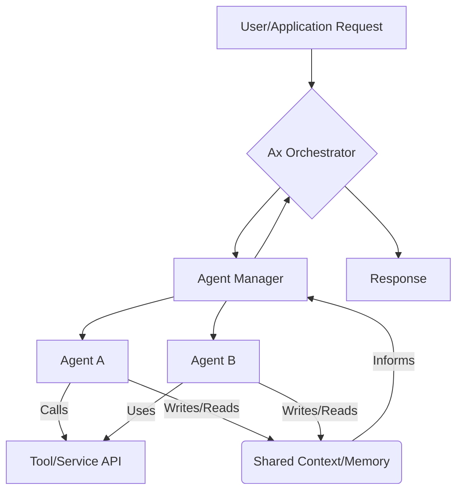

# Weekly Technology Intelligence Report (2026-40)

Generated: Sat, 03 Oct 2026 07:47:50 GMT

## 🏷️ Key Topics & Tags

`AI`  `LLM`  `GENERATIVE AI`  `WEB DEVELOPMENT`  `SECURITY`  `OPERATING SYSTEMS`  `CLOUD COMPUTING`  `HARDWARE`  `MOBILE DEVELOPMENT`  `DATA INFRASTRUCTURE`

## 🤖 AI Trend Analysis

# 📊 Tổng Quan

Hôm nay, các xu hướng công nghệ nổi bật xoay quanh trí tuệ nhân tạo (AI), đặc biệt là các **AI Agents**, cùng với sự phát triển của công cụ tạo nội dung đa phương tiện và các framework lập trình nền tảng.

### Top 5 công nghệ hoặc dự án đáng chú ý nhất hôm nay:

1.  **MoneyPrinterTurbo / hyperframes**: Hai dự án này cùng đại diện cho xu hướng tự động hóa tạo nội dung video bằng AI. `MoneyPrinterTurbo` sử dụng mô hình AI để tự động tạo video ngắn từ chủ đề/từ khóa, trong khi `hyperframes` cho phép render video từ HTML/CSS/JS, đặc biệt tối ưu cho các tác nhân AI.
2.  **pytorch / pytorch**: Một framework học sâu (deep learning) hàng đầu, tiếp tục là nền tảng cho nhiều nghiên cứu và ứng dụng AI, đặc biệt với khả năng tăng tốc GPU mạnh mẽ.
3.  **google / ax**: Runtime mã nguồn mở của Google để điều phối các tác nhân AI (agentic orchestration). Đây là một dự án quan trọng cho việc xây dựng và quản lý các hệ thống AI phức tạp.
4.  **flutter / flutter**: Framework UI của Google để xây dựng ứng dụng đa nền tảng (mobile, web, desktop) một cách nhanh chóng và hiệu quả.
5.  **paperclipai / paperclip**: Một ứng dụng mã nguồn mở giúp quản lý các AI agents trong môi trường công việc, nhấn mạnh xu hướng AI agent trong doanh nghiệp.

### Vì sao chúng đang nổi lên:

*   **Sự bùng nổ của AI Agents**: Hàng loạt dự án GitHub trending tập trung vào AI Agents (MoneyPrinterTurbo, Google Ax, Octop, hyperframes, claude-skills, hindsight, paperclipai) cho thấy đây là một bước tiến lớn trong việc tự động hóa và giải quyết các tác vụ phức tạp. Các agent có khả năng tự lập kế hoạch và thực hiện hành động, mở ra nhiều ứng dụng mới.
*   **Tự động hóa tạo nội dung**: Nhu cầu tạo video, âm thanh và các dạng nội dung đa phương tiện khác đang tăng vọt, và AI đang trở thành công cụ đắc lực để tự động hóa quá trình này, giảm chi phí và tăng tốc độ sản xuất.
*   **Công cụ nền tảng và phát triển hiệu quả**: Các framework như PyTorch, Flutter, Next.js tiếp tục được cải tiến, giúp developer xây dựng các hệ thống và ứng dụng mạnh mẽ hơn, nhanh hơn.

### Ai nên quan tâm:

*   **Kỹ sư Backend & SRE**: Cần quan tâm đến cách xây dựng, triển khai và quản lý các hệ thống AI Agents (đặc biệt là orchestration), các hệ thống xử lý media, và cách tối ưu hóa hiệu suất của các dịch vụ AI.
*   **Kỹ sư AI/ML**: Cần theo dõi các framework AI Agents, kỹ thuật prompt engineering, và các công cụ giúp họ ứng dụng mô hình AI vào các sản phẩm thực tế.
*   **Developer Cloud/DevOps**: Cần hiểu về hạ tầng cần thiết để chạy các tác vụ AI và AI Agents, quản lý tài nguyên tính toán (CPU/GPU), và triển khai các giải pháp AI một cách hiệu quả và an toàn.
*   **Kỹ sư Frontend/Mobile**: Các framework như Flutter và Next.js vẫn là trụ cột, cùng với cách AI có thể được tích hợp vào trải nghiệm người dùng.

### Dự án phân tích chuyên sâu:

Để cung cấp góc nhìn sâu sắc hơn cho kỹ sư backend và SRE, tôi sẽ chọn phân tích chuyên sâu hai dự án sau:

1.  **google / ax**: Lý do chọn là đây là một **runtime điều phối tác nhân AI (agentic orchestration)** từ một ông lớn công nghệ như Google. Nó đại diện cho xu hướng quan trọng về hạ tầng để quản lý các hệ thống AI Agents phức tạp, có tính liên quan trực tiếp đến kiến trúc hệ thống và DevOps.
2.  **heygen-com / hyperframes**: Lý do chọn là dự án này thể hiện một cách tiếp cận **kỹ thuật độc đáo** (sử dụng HTML/CSS/JS để render video) và có **tính ứng dụng cao** trong việc tự động hóa quy trình tạo nội dung đa phương tiện, đặc biệt khi được điều khiển bởi AI Agents. Điều này rất thú vị cho các kỹ sư backend thường xuyên xử lý dữ liệu và cần tạo ra đầu ra đa dạng.

---

# 🔥 Phân Tích Chuyên Sâu

## google / ax

### Mô tả

Google Ax là một runtime mã nguồn mở được thiết kế để điều phối (orchestrate) các tác nhân AI (AI agents). Nó cung cấp một khung sườn để các agent có thể tương tác, chia sẻ thông tin và cộng tác để thực hiện các mục tiêu phức tạp, đòi hỏi nhiều bước và nhiều vai trò khác nhau. Ax giúp định nghĩa và quản lý luồng công việc của các agent, từ đó xây dựng các hệ thống AI có khả năng lập kế hoạch và thực thi cao hơn.

### URL

[https://github.com/google/ax](https://github.com/google/ax)

### Tại sao đang nổi bật

Dự án đang nổi bật vì nó giải quyết một vấn đề cốt lõi trong kỷ nguyên AI Agents: làm thế nào để quản lý sự tương tác và phối hợp của nhiều tác nhân AI. Với sự bảo trợ của Google, đây là một nền tảng đáng tin cậy cho kiến trúc hệ thống AI trong tương lai. Số lượng sao (Score: 12945) cho thấy sự quan tâm lớn từ cộng đồng đối với giải pháp orchestration cho AI Agents.

### Nguyên lý cơ bản

Nguyên lý cơ bản của Ax là coi một nhiệm vụ phức tạp không phải là một yêu cầu-phản hồi đơn lẻ mà là một chuỗi các hành động có mục đích, được thực hiện bởi nhiều "agent" chuyên biệt. Ax cung cấp một "sân chơi" nơi các agent có thể "gặp gỡ", trao đổi thông tin thông qua một bộ nhớ chia sẻ (shared memory/context), và gọi các "công cụ" (tools) để tương tác với thế giới bên ngoài. Cách tiếp cận này khác với các hệ thống truyền thống thường là các dịch vụ độc lập hoặc microservices được điều phối bằng các API, ở chỗ Ax tập trung vào khả năng tự chủ và tương tác linh hoạt của các agent AI.

### Cơ chế hoạt động

1.  **Định nghĩa Agent (Agent Definition):** Các nhà phát triển định nghĩa từng AI agent với các khả năng, mục tiêu, và công cụ mà nó có thể sử dụng (ví dụ: một agent có thể truy vấn database, một agent khác có thể gọi API dịch vụ thanh toán).
2.  **Định nghĩa Luồng công việc (Workflow Definition):** Một "workflow" trong Ax mô tả cách các agent nên tương tác để hoàn thành một nhiệm vụ tổng thể. Điều này bao gồm các bước tuần tự, các điều kiện chuyển đổi giữa các agent, và các cơ chế chia sẻ thông tin.
3.  **Runtime Thực thi (Execution Runtime):** Khi một yêu cầu được gửi đến hệ thống Ax, runtime sẽ khởi động và thực thi luồng công việc đã định nghĩa. Nó chịu trách nhiệm gọi các agent theo đúng trình tự, cung cấp cho chúng thông tin cần thiết từ bộ nhớ chung, và quản lý các kết quả trả về.
4.  **Bộ nhớ chia sẻ (Shared Memory/Context):** Đây là nơi các agent lưu trữ và truy xuất thông tin, kết quả trung gian, và trạng thái hiện tại của luồng công việc. Điều này cho phép các agent cộng tác và xây dựng dựa trên công việc của nhau.
5.  **Tích hợp Công cụ (Tool Integration):** Các agent có thể được cấu hình để sử dụng các công cụ bên ngoài (ví dụ: các API REST, database, hệ thống file) để thực hiện các hành động cụ thể, mở rộng khả năng của chúng ra ngoài khả năng suy luận của mô hình ngôn ngữ.

### Sơ đồ kiến trúc (HLD)



*   **User/Application Request**: Điểm khởi đầu của một tác vụ, được gửi bởi người dùng hoặc một ứng dụng bên ngoài.
*   **Ax Orchestrator**: Thành phần trung tâm, nhận yêu cầu, tải và điều phối luồng công việc (workflow) của các agent.
*   **Agent Manager**: Chịu trách nhiệm khởi tạo, quản lý và điều khiển các Agent A, Agent B, v.v. dựa trên định nghĩa luồng công việc.
*   **Agent A, Agent B**: Các tác nhân AI độc lập, mỗi tác nhân có một vai trò cụ thể và bộ kỹ năng riêng. Chúng thực hiện các phần của tác vụ tổng thể.
*   **Tool/Service API**: Các công cụ hoặc API bên ngoài mà các agent có thể gọi để thực hiện hành động (ví dụ: truy vấn CSDL, gửi email, gọi API external service).
*   **Shared Context/Memory**: Một không gian lưu trữ chung nơi các agent chia sẻ thông tin, trạng thái, và kết quả trung gian để cộng tác và duy trì ngữ cảnh.
*   **Response**: Kết quả cuối cùng của toàn bộ luồng công việc được trả về cho người dùng/ứng dụng.

### Có thể áp dụng vào dự án như thế nào?

*   **Tự động hóa hỗ trợ khách hàng nâng cao**: Xây dựng một hệ thống agent gồm Agent A (hiểu ý định khách hàng), Agent B (tìm kiếm thông tin trong cơ sở tri thức), Agent C (tương tác với hệ thống CRM để lấy lịch sử), và Agent D (soạn thảo phản hồi hoặc escalate vấn đề). Ax sẽ điều phối các agent này để xử lý yêu cầu từ đầu đến cuối.
*   **Tạo pipeline dữ liệu thông minh**: Thay vì các pipeline ETL tĩnh, một hệ thống agent có thể có Agent A (thu thập dữ liệu), Agent B (làm sạch và chuẩn hóa dữ liệu dựa trên ngữ cảnh), Agent C (phân tích và tạo báo cáo), và Agent D (tải dữ liệu đã xử lý vào data warehouse). Ax giúp quản lý sự phức tạp của các bước xử lý và các điều kiện chuyển đổi.
*   **Hệ thống code review hoặc refactoring tự động**: Agent A phân tích mã nguồn và phát hiện các vấn đề tiềm ẩn, Agent B đề xuất các cải tiến về kiến trúc hoặc hiệu năng, Agent C thực hiện refactoring mã nguồn, và Agent D chạy các bài kiểm thử để xác nhận.

### Tips áp dụng ngay trong công việc

1.  **Định nghĩa vai trò rõ ràng cho các agent**: Tương tự như microservices, mỗi agent nên có một trách nhiệm duy nhất và được xác định rõ ràng. Điều này giúp dễ dàng quản lý, mở rộng và gỡ lỗi.
2.  **Thiết kế cấu trúc dữ liệu chia sẻ hiệu quả**: Xác định rõ ràng schema và cách thức các agent tương tác với `Shared Context/Memory`. Sử dụng các định dạng chuẩn (như JSON) và cơ chế khóa/đảm bảo tính nhất quán nếu cần.
3.  **Xây dựng các công cụ (tools) có thể tái sử dụng**: Bọc các tương tác với hệ thống bên ngoài (database, API) thành các "tools" độc lập mà nhiều agent có thể sử dụng. Điều này tăng khả năng tái sử dụng và giảm sự phụ thuộc giữa các agent.
4.  **Triển khai logging và monitoring chi tiết**: Để hiểu được cách các agent tương tác và hoạt động, cần có hệ thống logging chi tiết cho từng bước của agent, việc sử dụng tools, và trạng thái của `Shared Context/Memory`. Điều này rất quan trọng cho việc gỡ lỗi và tối ưu hóa.

### Bài tập thực hành (1 buổi tối hoặc 1 cuối tuần)

**Mục tiêu:** Xây dựng một trình điều phối (orchestrator) đơn giản cho 3 "agent" Python để tự động hóa quy trình phân loại và phản hồi email.

**Công cụ/Stack cần thiết:**
*   Python 3.x
*   Thư viện `FastAPI` (cho API của Orchestrator)
*   Thư viện `langchain-core` (để hiểu khái niệm Agent/Tool, không cần LLM phức tạp) hoặc chỉ dùng các hàm Python đơn giản.
*   `SQLite` (cho Shared Context/Memory)

**Các bước chính:**
1.  **Tạo 3 agent (hàm Python):**
    *   `Agent_Classifier(email_content)`: Nhận nội dung email, trả về loại email (ví dụ: "Support", "Sales", "General"). (Có thể dùng regex đơn giản hoặc keyword matching thay vì ML).
    *   `Agent_Knowledge_Base_Search(query)`: Nhận một truy vấn, giả lập tìm kiếm trong một "cơ sở tri thức" (một dictionary hoặc SQLite table nhỏ), trả về các thông tin liên quan.
    *   `Agent_Responder(email_type, knowledge_data)`: Nhận loại email và dữ liệu tri thức, trả về một bản nháp phản hồi email.
2.  **Thiết lập Shared Context/Memory:** Sử dụng một database `SQLite` đơn giản để lưu trữ trạng thái hiện tại của email (nội dung, loại, dữ liệu tìm kiếm, bản nháp phản hồi).
3.  **Xây dựng Orchestrator (FastAPI app):**
    *   Tạo một endpoint POST `/process_email` nhận nội dung email.
    *   Trong endpoint này, Orchestrator sẽ:
        *   Lưu nội dung email vào SQLite.
        *   Gọi `Agent_Classifier`, lưu kết quả vào SQLite.
        *   Nếu loại email là "Support", gọi `Agent_Knowledge_Base_Search` với một truy vấn dựa trên nội dung email, lưu kết quả.
        *   Gọi `Agent_Responder` với các thông tin đã thu thập, lưu bản nháp phản hồi.
        *   Trả về bản nháp phản hồi.
4.  **Kiểm thử:** Gửi một vài nội dung email mẫu đến API và kiểm tra kết quả.

**Kết quả mong đợi:** Một API hoạt động, có khả năng điều phối các hàm Python khác nhau (agents) để xử lý email theo một luồng đã định, lưu trữ trạng thái giữa các bước.

### Ưu điểm

*   **Cấu trúc hóa sự phức tạp**: Cung cấp một framework rõ ràng để quản lý luồng tác vụ giữa nhiều agent AI.
*   **Khả năng mở rộng và tái sử dụng**: Cho phép xây dựng các agent chuyên biệt và tái sử dụng chúng trong các luồng công việc khác nhau.
*   **Cải thiện khả năng quan sát**: Giúp theo dõi và gỡ lỗi các hệ thống AI phức tạp dễ dàng hơn nhờ quản lý trạng thái tập trung.

### Nhược điểm

*   **Tăng độ phức tạp kiến trúc**: Việc giới thiệu một lớp orchestration có thể làm tăng sự phức tạp tổng thể của hệ thống.
*   **Chi phí thiết kế luồng công việc**: Cần đầu tư đáng kể vào việc thiết kế và tối ưu hóa các luồng công việc của agent để đạt hiệu quả cao.
*   **Hiệu suất**: Có thể có overhead về hiệu suất do việc điều phối và truyền dữ liệu giữa các agent và bộ nhớ chia sẻ.

## heygen-com / hyperframes

### Mô tả

hyperframes là một thư viện cho phép bạn tạo video chất lượng cao bằng cách render nội dung từ HTML, CSS và JavaScript. Nó được thiết kế đặc biệt để tích hợp với các hệ thống AI agent, giúp tự động hóa việc sản xuất nội dung video theo yêu cầu một cách linh hoạt và hiệu quả. Về cơ bản, bạn "viết" video bằng cách sử dụng các công nghệ web quen thuộc.

### URL

[https://github.com/heygen-com/hyperframes](https://github.com/heygen-com/hyperframes)

### Tại sao đang nổi bật

hyperframes đang gây chú ý (Score: 56018) vì nó mang đến một cách tiếp cận sáng tạo và mạnh mẽ để tạo video. Việc sử dụng HTML/CSS/JS làm ngôn ngữ "kịch bản" cho video giúp các nhà phát triển web dễ dàng tham gia vào việc tạo nội dung đa phương tiện mà không cần học các công cụ video chuyên biệt. Khả năng tích hợp với AI agents giúp mở rộng đáng kể khả năng tự động hóa và cá nhân hóa việc sản xuất video, giải quyết nhu cầu lớn về nội dung động và tùy chỉnh.

### Nguyên lý cơ bản

Nguyên lý cốt lõi của hyperframes là biến một trình duyệt web không giao diện (headless browser) thành một "xưởng phim". Thay vì render một trang web tĩnh, hyperframes điều khiển trình duyệt để chụp ảnh màn hình (screenshot) tại mỗi khoảng thời gian cực nhỏ (ví dụ: mỗi 1/30 giây để tạo video 30 khung hình/giây). Những ảnh chụp này, được tạo ra từ nội dung HTML/CSS/JS động (bao gồm animations và tương tác JavaScript), sau đó được ghép lại thành một chuỗi hình ảnh và được encode thành một file video hoàn chỉnh. Cách tiếp cận này tận dụng sức mạnh render đồ họa của trình duyệt và sự linh hoạt của công nghệ web để tạo ra nội dung video, khác biệt hoàn toàn so với các công cụ chỉnh sửa video truyền thống hoặc các thư viện đồ họa cấp thấp.

### Cơ chế hoạt động

1.  **Đầu vào HTML/CSS/JS (Content Source):** Người dùng hoặc một AI agent cung cấp các file HTML, CSS và JavaScript. Các file này định nghĩa bố cục, kiểu dáng và hành vi động (ví dụ: hoạt ảnh, thay đổi nội dung) của từng khung hình trong video.
2.  **Khởi tạo Headless Browser:** hyperframes khởi động một trình duyệt web không giao diện (ví dụ: Chromium thông qua Puppeteer hoặc Playwright) trên máy chủ.
3.  **Render và Chụp ảnh khung hình (Frame Rendering & Capture):** Trình duyệt headless tải và render các file HTML/CSS/JS. Tại mỗi điểm thời gian được chỉ định (tùy thuộc vào tốc độ khung hình mong muốn của video), hyperframes ra lệnh cho trình duyệt chụp một ảnh màn hình của trạng thái hiện tại của trang web. Nếu có JavaScript tạo hiệu ứng động, trình duyệt sẽ cập nhật trạng thái và hyperframes sẽ chụp ảnh trạng thái mới.
4.  **Tạo chuỗi ảnh (Image Sequence):** Các ảnh màn hình được chụp sẽ tạo thành một chuỗi các file hình ảnh tĩnh (ví dụ: PNG).
5.  **Mã hóa video (Video Encoding):** Chuỗi hình ảnh này sau đó được chuyển đến một công cụ mã hóa video mạnh mẽ (ví dụ: FFmpeg). FFmpeg sẽ ghép các hình ảnh lại với nhau theo đúng trình tự và tốc độ khung hình, thêm âm thanh (nếu có) và mã hóa chúng thành một file video ở định dạng mong muốn (ví dụ: MP4, WebM).
6.  **Tích hợp Agent (Agent Integration):** Các AI agents có thể được sử dụng để tự động sinh ra các file HTML/CSS/JS dựa trên các yêu cầu bằng ngôn ngữ tự nhiên, hoặc điều khiển các tham số render của hyperframes.

### Sơ đồ kiến trúc (HLD)

```mermaid
graph TD
    A[User Input/AI Agent Prompt] --> B{Content Generator (AI/Human)};
    B -- Generates --> C[HTML/CSS/JS Scene Files];
    C --> D[Hyperframes CLI/API];
    D --> E[Headless Browser (e.g., Chromium)];
    E -- Renders Frames --> F[Image Sequence];
    F --> G[Video Encoder (e.g., FFmpeg)];
    G --> H[Output Video File];
    D -- Configures --> E;
```

*   **User Input/AI Agent Prompt**: Yêu cầu tạo video, có thể từ giao diện người dùng hoặc từ một tác nhân AI (ví dụ: "Tạo video quảng cáo sản phẩm X").
*   **Content Generator (AI/Human)**: Thành phần tạo ra các file HTML/CSS/JS. Có thể là do một developer viết thủ công các template, hoặc một AI agent tự động sinh mã dựa trên prompt.
*   **HTML/CSS/JS Scene Files**: Các file mã nguồn web định nghĩa nội dung, bố cục, và hoạt ảnh của video.
*   **Hyperframes CLI/API**: Giao diện dòng lệnh hoặc API (Application Programming Interface) mà hệ thống backend/agent sử dụng để tương tác với hyperframes và bắt đầu quá trình render video.
*   **Headless Browser (e.g., Chromium)**: Một phiên bản của trình duyệt web chạy ẩn, không có giao diện người dùng, được hyperframes sử dụng để tải các file HTML/CSS/JS và hiển thị nội dung.
*   **Image Sequence**: Các hình ảnh tĩnh (khung hình) được chụp liên tiếp từ trình duyệt headless tại các điểm thời gian khác nhau.
*   **Video Encoder (e.g., FFmpeg)**: Một công cụ mã nguồn mở mạnh mẽ được sử dụng để nối chuỗi hình ảnh thành một file video hoàn chỉnh và nén nó.
*   **Output Video File**: File video cuối cùng được tạo ra (ví dụ: MP4).

### Có thể áp dụng vào dự án như thế nào?

*   **Tạo video quảng cáo cá nhân hóa hàng loạt**: Một hệ thống backend có thể lấy dữ liệu sản phẩm và thông tin khách hàng từ database, sau đó sử dụng AI agent hoặc template engine để tự động sinh ra các file HTML/CSS/JS cho từng quảng cáo. hyperframes sẽ render các file này thành hàng trăm video quảng cáo độc đáo, cá nhân hóa cho từng phân khúc khách hàng.
*   **Sinh video báo cáo động**: Thay vì các báo cáo PDF tĩnh, hệ thống có thể tạo các báo cáo dưới dạng video. Dữ liệu từ database được đưa vào các template HTML chứa biểu đồ và đồ thị động (ví dụ: dùng Chart.js), sau đó hyperframes sẽ render các animation của biểu đồ thành video giải thích trực quan.
*   **Tạo video tóm tắt tin tức tự động**: AI agent có thể tóm tắt các bài báo, chọn lọc hình ảnh và video liên quan, sau đó dùng các tóm tắt và hình ảnh này để điền vào template HTML. hyperframes sẽ render thành các video tin tức ngắn gọn để đăng lên mạng xã hội.

### Tips áp dụng ngay trong công việc

1.  **Tối ưu hóa hiệu suất HTML/CSS/JS**: Giống như việc tối ưu hóa hiệu suất trang web, các animation JavaScript và CSS phức tạp hoặc không tối ưu có thể làm chậm quá trình render khung hình, dẫn đến video bị giật hoặc quá trình xử lý lâu. Hãy giữ mã nguồn web gọn gàng và hiệu quả.
2.  **Quản lý tài nguyên trình duyệt headless**: Việc chạy một trình duyệt headless tốn nhiều tài nguyên CPU và RAM. Đối với các ứng dụng có khối lượng công việc lớn, hãy cân nhắc chạy hyperframes trong môi trường container hóa (Docker) và sử dụng các công cụ orchestration (Kubernetes) để quản lý tài nguyên, chia sẻ tải, hoặc triển khai trên serverless để chỉ trả tiền khi sử dụng.
3.  **Sử dụng template engine cho nội dung động**: Để tích hợp AI agent hoặc dữ liệu backend một cách hiệu quả, hãy xây dựng các template HTML với các placeholder. Sau đó, backend hoặc AI agent có thể điền dữ liệu vào template này trước khi gửi cho hyperframes render.
4.  **Cache và tái sử dụng thành phần**: Nếu có các thành phần video lặp lại (ví dụ: intro/outro, logo animation), hãy render chúng một lần và lưu trữ dưới dạng video clip, sau đó sử dụng FFmpeg để ghép chúng với nội dung động được tạo bởi hyperframes, tiết kiệm thời gian và tài nguyên render.

### Bài tập thực hành (1 buổi tối hoặc 1 cuối tuần)

**Mục tiêu:** Tạo một video ngắn chào mừng (welcome video) động từ một template HTML/CSS/JS đơn giản, với tên người dùng được cá nhân hóa.

**Công cụ/Stack cần thiết:**
*   Node.js (để chạy hyperframes, có thể sử dụng CLI hoặc thư viện)
*   HTML, CSS, JavaScript (để tạo nội dung video)
*   FFmpeg (cần được cài đặt trên hệ thống để mã hóa video)
*   Thư viện `Puppeteer` hoặc `Playwright` (nếu hyperframes chưa có API Node.js trực tiếp mà bạn muốn tự kiểm soát headless browser).

**Các bước chính:**
1.  **Cài đặt hyperframes và FFmpeg:** Làm theo hướng dẫn cài đặt trên repository GitHub của hyperframes và đảm bảo FFmpeg đã được cài đặt và có trong PATH của hệ thống.
2.  **Tạo file HTML template (`welcome.html`):**
    *   Tạo một file HTML đơn giản với một `<div>` chứa một thẻ `<p id="username">Chào mừng, [TÊN NGƯỜI DÙNG]!</p>`.
    *   Sử dụng CSS để tạo kiểu dáng hấp dẫn (màu sắc, phông chữ, căn giữa).
3.  **Tạo file JavaScript (`script.js`):**
    *   Thêm một script JavaScript vào `welcome.html`.
    *   Script này sẽ có một animation đơn giản, ví dụ: văn bản "Chào mừng" hiện ra từ mờ dần (fade-in) sau 1 giây, sau đó văn bản tên người dùng hiện ra sau 0.5 giây nữa.
    *   Có thể lấy tên người dùng từ một biến toàn cục được truyền vào bởi Node.js.
4.  **Viết script Node.js (hoặc sử dụng CLI của hyperframes):**
    *   Script này sẽ đọc `welcome.html`.
    *   Thay thế `[TÊN NGƯỜI DÙNG]` bằng một tên cụ thể (ví dụ: "Kỹ sư Backend").
    *   Sử dụng hyperframes để render HTML đã được sửa đổi thành một video MP4 dài 5 giây.
    *   Chỉ định độ phân giải video (ví dụ: 1280x720) và tốc độ khung hình (ví dụ: 30fps).
5.  **Chạy và kiểm tra:** Chạy script Node.js và xem video `welcome.mp4` được tạo ra. Thử thay đổi tên người dùng và render lại.

**Kết quả mong đợi:** Một file video MP4 ngắn gọn với thông điệp chào mừng và tên người dùng được cá nhân hóa, cùng với một hoạt ảnh đơn giản.

### Ưu điểm

*   **Sử dụng kỹ năng web hiện có**: Cho phép các nhà phát triển web tạo video mà không cần học các công cụ đồ họa hoặc chỉnh sửa video phức tạp.
*   **Tính linh hoạt cao**: HTML/CSS/JS cung cấp khả năng không giới hạn để tạo ra các hiệu ứng hình ảnh, hoạt ảnh và nội dung động.
*   **Cá nhân hóa và tự động hóa mạnh mẽ**: Lý tưởng để tạo hàng loạt video cá nhân hóa dựa trên dữ liệu hoặc được điều khiển bởi AI agents.

### Nhược điểm

*   **Yêu cầu tài nguyên cao**: Quá trình render bằng headless browser và mã hóa video tiêu tốn nhiều CPU và RAM, đặc biệt với video độ phân giải cao hoặc tốc độ khung hình lớn.
*   **Hạn chế về chất lượng chuyên nghiệp**: Khó đạt được chất lượng xử lý hậu kỳ, hiệu ứng đặc biệt hoặc kiểm soát màu sắc chính xác như các phần mềm chỉnh sửa video chuyên nghiệp.
*   **Gỡ lỗi phức tạp**: Gỡ lỗi các vấn đề về timing, animation trong môi trường headless browser có thể khó khăn hơn so với việc gỡ lỗi một trang web thông thường.

---

# 💬 Các Chủ Đề Đang Được Thảo Luận

Các chủ đề thảo luận trên Hacker News và Reddit cho thấy sự tập trung mạnh mẽ vào AI, cùng với các vấn đề về quyền riêng tư, bảo mật và cải thiện quy trình phát triển.

*   **Tiến bộ và Giới hạn của AI**: Các bài viết như "Understanding Frontier Artificial Intelligence" và "Extra Big Ass Intelligence" cho thấy sự tò mò và cả sự hoài nghi về khả năng thực sự của các mô hình AI tiên tiến nhất. "With most information hidden, the game Stratego had stumped AI until now" minh họa cách AI tiếp tục vượt qua các thách thức mới, nhưng cũng nhắc nhở rằng vẫn còn những giới hạn.
*   **Triển khai AI cục bộ (Local LLMs)**: Chủ đề "From the creator of Redis; run LLM locally with ds4" và "One month coding with GLM 5.3 Flash" cho thấy một xu hướng quan trọng: mong muốn chạy các mô hình ngôn ngữ lớn (LLM) trên phần cứng cá nhân hoặc máy chủ riêng thay vì phụ thuộc vào cloud. Điều này xuất phát từ các lo ngại về chi phí, quyền riêng tư dữ liệu, và khả năng tùy chỉnh.
*   **Bảo mật trong kỷ nguyên AI**: Bài phát biểu của Greg Kroah-Hartman về "Security in the LLM Age" nhấn mạnh những thách thức bảo mật mới mà AI mang lại, từ lỗ hổng trong mô hình đến rủi ro trong việc tích hợp AI vào các hệ thống quan trọng. Đây là một chủ đề thiết yếu cho các SRE và kỹ sư bảo mật.
*   **Quyền riêng tư và Kiểm soát Dữ liệu**: "Cloudflare OHTTP gateway" (cổng OHTTP của Cloudflare) và "Court agrees with EFF: Utah's VPN law demands a technical impossibility" cho thấy các cuộc tranh luận liên tục về quyền riêng tư trên internet và khả năng kiểm soát dữ liệu cá nhân. Các kỹ sư backend/DevOps cần hiểu rõ hơn về các giao thức bảo mật và quy định pháp lý liên quan đến dữ liệu.
*   **Cải thiện trải nghiệm và công cụ phát triển**: Các thảo luận về "Make Tmux the OS" và "Updates to Full Disk Access in macOS" cho thấy cộng đồng developer luôn tìm cách tối ưu hóa môi trường làm việc và công cụ của mình. "Sites in ChatGPT" cũng gợi ý về cách AI có thể tích hợp vào các công cụ phát triển để tăng năng suất.
*   **Đổi mới phần cứng**: "The Forgetful CPU (Linux on M4)" và "OKI Develops 124-Layer PCB Technology" thể hiện sự quan tâm đến những tiến bộ trong công nghệ phần cứng, điều này có tác động lâu dài đến hiệu suất và khả năng của các hệ thống phần mềm.

---

# 🏗️ Xu Hướng Kiến Trúc & Kỹ Thuật

Dựa trên dữ liệu thu thập được, có một số xu hướng kiến trúc và kỹ thuật nổi bật:

*   **AI Agents**:
    *   **Là gì:** Các chương trình phần mềm tự trị có khả năng lý luận, lập kế hoạch, và thực hiện hành động để đạt được một mục tiêu cụ thể. Chúng thường sử dụng các mô hình ngôn ngữ lớn (LLM) để hiểu ngữ cảnh và đưa ra quyết định, kết hợp với các "công cụ" (tools) để tương tác với môi trường bên ngoài (API, database, hệ thống file).
    *   **Tại sao quan trọng với backend/DevOps/SRE:**
        *   **Backend:** Cần xây dựng và quản lý các dịch vụ hỗ trợ các agent (cung cấp API cho tools, lưu trữ trạng thái, xử lý dữ liệu).
        *   **DevOps/SRE:** Phải thiết kế hạ tầng để triển khai, mở rộng, giám sát và bảo mật các hệ thống agent (ví dụ: điều phối nhiều agent với Google Ax, quản lý bộ nhớ cho agent với Hindsight, tự động hóa quy trình với MoneyPrinterTurbo). Việc đảm bảo tính sẵn sàng và hiệu suất của các agent là thách thức mới.
    *   **Dự án liên quan:** `google/ax`, `MoneyPrinterTurbo`, `TencentCloud/Octop`, `hyperframes`, `alirezarezvani/claude-skills`, `vectorize-io/hindsight`, `paperclipai`.

*   **Local-first AI / Self-hosting AI**:
    *   **Là gì:** Xu hướng triển khai các mô hình AI hoặc các ứng dụng AI trên cơ sở hạ tầng cục bộ (máy tính cá nhân, máy chủ riêng) thay vì hoàn toàn phụ thuộc vào các dịch vụ đám mây. Mục tiêu là kiểm soát dữ liệu, giảm chi phí vận hành, và cải thiện hiệu suất/latency.
    *   **Tại sao quan trọng với backend/DevOps/SRE:**
        *   **Backend:** Cần tối ưu hóa các ứng dụng AI để chạy trên tài nguyên hạn chế, phát triển các API giao tiếp với các mô hình cục bộ.
        *   **DevOps/SRE:** Phải quản lý và tối ưu hóa phần cứng (CPU, GPU) cho các tác vụ AI cục bộ, xây dựng các giải pháp container hóa hoặc ảo hóa để triển khai các mô hình này, đảm bảo bảo mật cho dữ liệu nhạy cảm được xử lý cục bộ.
    *   **Dự án liên quan:** `debpalash/VoiceStudio` (ElevenLabs alternative tự host), thảo luận về "run LLM locally with ds4" trên HN.

*   **Accelerated Computing (GPU/CPU/Accelerators kernels)**:
    *   **Là gì:** Việc tối ưu hóa các tác vụ tính toán chuyên sâu bằng cách tận dụng các bộ xử lý chuyên dụng như GPU (Graphics Processing Unit) hoặc các accelerator khác thay vì chỉ CPU thông thường. Điều này đặc biệt quan trọng cho các tác vụ tính toán ma trận, xử lý tín hiệu, và học máy.
    *   **Tại sao quan trọng với backend/DevOps/SRE:**
        *   **Backend:** Cần thiết kế các dịch vụ có thể tận dụng hiệu quả GPU để xử lý inference/training mô hình AI, hoặc các tác vụ media processing đòi hỏi nhiều tài nguyên.
        *   **DevOps/SRE:** Phải quản lý cơ sở hạ tầng với các GPU (cấp phát, giám sát, driver), triển khai các container được cấu hình để truy cập GPU, và tối ưu hóa việc sử dụng tài nguyên đắt tiền này.
    *   **Dự án liên quan:** `pytorch/pytorch`, `tile-ai/tilelang` (DSL để streamline phát triển kernels cho GPU/CPU/Accelerators).

*   **Platform Engineering (cho AI/Agents)**:
    *   **Là gì:** Một kỷ luật tập trung vào việc xây dựng và duy trì các nền tảng tự phục vụ (self-service platforms) cho nhà phát triển. Trong bối cảnh AI, điều này có nghĩa là cung cấp các công cụ, framework và quy trình để giúp các nhóm dễ dàng xây dựng, triển khai và quản lý các ứng dụng AI và AI agents mà không cần phải hiểu sâu về các chi tiết hạ tầng phức tạp.
    *   **Tại sao quan trọng với backend/DevOps/SRE:**
        *   **Backend:** Cần đóng góp vào việc xây dựng các "building blocks" (API, dịch vụ) để các nền tảng AI có thể sử dụng.
        *   **DevOps/SRE:** Là những người đứng đằng sau việc xây dựng và duy trì các nền tảng này, từ việc cung cấp môi trường chạy agent (như Google Ax) đến các công cụ quản lý agent (như PaperclipAI), tự động hóa CI/CD cho các ứng dụng AI, và cung cấp khả năng quan sát (observability).
    *   **Dự án liên quan:** `google/ax` (cung cấp runtime nền tảng), `paperclipai/paperclip` (công cụ quản lý agent tại nơi làm việc).

---

# 🎯 Gợi Ý Học Tập

## Nên học ngay

1.  **Cơ bản về AI Agents & LLM Interaction**: Đây là xu hướng đang bùng nổ và có ứng dụng thực tế rất lớn.
    *   **Lý do**: Hiểu cách các mô hình ngôn ngữ lớn (LLM) hoạt động, cách viết "prompt" hiệu quả (prompt engineering), và cách các agent được thiết kế để sử dụng LLM cùng với "công cụ" (tools) để thực hiện các hành động. Điều này trực tiếp liên quan đến việc xây dựng các hệ thống tự động hóa thông minh.
    *   **Học gì**: Bắt đầu với các tutorial về `LangChain` hoặc `LlamaIndex` để xây dựng các agent đơn giản, hiểu khái niệm về tools, memory và chains.
2.  **Containerization (Docker) & Orchestration (Kubernetes basics)**: Hầu hết các ứng dụng AI và hạ tầng phục vụ chúng đều được triển khai trong containers.
    *   **Lý do**: Đây là kỹ năng nền tảng cho mọi kỹ sư backend, DevOps, SRE trong môi trường cloud hiện đại. Việc triển khai và quản lý các hệ thống AI Agents đòi hỏi khả năng đóng gói (packaging), triển khai và mở rộng (scaling) ứng dụng một cách hiệu quả.
    *   **Học gì**: Thực hành Dockerfile, Docker Compose, và các khái niệm cơ bản về Pod, Deployment, Service trong Kubernetes.
3.  **Python và các thư viện AI cơ bản (PyTorch/TensorFlow)**: Python là ngôn ngữ chính cho AI.
    *   **Lý do**: Mặc dù bạn không nhất thiết phải trở thành một nhà khoa học dữ liệu, việc có kiến thức cơ bản về cách các mô hình AI được định nghĩa, huấn luyện và sử dụng trong PyTorch (hoặc TensorFlow) sẽ giúp bạn hiểu sâu hơn về cách tích hợp chúng vào hệ thống backend.
    *   **Học gì**: Làm quen với cú pháp cơ bản của PyTorch, cách define một neural network đơn giản, và cách thực hiện inferencing.

## Nên theo dõi

1.  **Agent Orchestration Frameworks (như Google Ax)**:
    *   **Lý do**: Khi các hệ thống AI Agents ngày càng phức tạp, việc điều phối và quản lý chúng trở nên tối quan trọng. Các framework như Ax sẽ định hình cách chúng ta xây dựng và vận hành các hệ thống AI quy mô lớn. Nó vẫn đang trong giai đoạn đầu nhưng có tiềm năng rất lớn.
    *   **Theo dõi gì**: Theo dõi repository của Google Ax, đọc các bài viết về kiến trúc Agentic Systems và cách các công ty lớn giải quyết bài toán orchestration.
2.  **Local LLMs & On-device AI**:
    *   **Lý do**: Xu hướng này giải quyết các vấn đề về quyền riêng tư, chi phí cloud, và độ trễ. Khi các mô hình AI ngày càng nhỏ gọn và hiệu quả, khả năng chạy chúng cục bộ sẽ mở ra nhiều ứng dụng mới và giảm sự phụ thuộc vào các nhà cung cấp dịch vụ lớn.
    *   **Theo dõi gì**: Các dự án như `ollama`, `llama.cpp`, các bản cập nhật về tối ưu hóa mô hình (quantization, pruning), và các bài viết về kiến trúc RAG (Retrieval Augmented Generation) cho LLM cục bộ.
3.  **Web-to-Video Rendering (như Hyperframes)**:
    *   **Lý do**: Cách tiếp cận sáng tạo này giúp các kỹ sư backend và web tận dụng kỹ năng hiện có để tạo ra nội dung đa phương tiện động một cách tự động. Nó có tiềm năng lớn trong marketing, truyền thông và tạo báo cáo trực quan.
    *   **Theo dõi gì**: Theo dõi repository của hyperframes, tìm hiểu về các thư viện như `Puppeteer` hoặc `Playwright` và cách chúng được dùng để điều khiển headless browser cho các tác vụ tự động hóa.

## Có dấu hiệu hype

1.  **"Extra Big Ass Intelligence" / "Frontier AI"**:
    *   **Lý do**: Các thuật ngữ này thường được dùng để chỉ các mô hình AI tiên tiến nhất, với khả năng vượt trội so với những gì chúng ta từng thấy. Mặc dù đây là lĩnh vực nghiên cứu quan trọng và hấp dẫn, nhưng nó thường đi kèm với những kỳ vọng phóng đại và chưa thực tế về khả năng ứng dụng đại trà trong ngắn hạn. Hầu hết các kỹ sư backend sẽ làm việc với các ứng dụng AI thực tế, ít phức tạp hơn nhiều.
    *   **Lưu ý**: Hãy tiếp cận với thái độ cẩn trọng, tập trung vào những ứng dụng thực tiễn và giải quyết vấn đề cụ thể, thay vì chạy theo những lời hứa "thay đổi thế giới" chưa có bằng chứng rõ ràng.

---

# 💡 Ý Tưởng Side Project

Dưới đây là 5 ý tưởng side project lấy cảm hứng từ các xu hướng công nghệ hôm nay, tập trung vào Backend, DevOps, Infrastructure, Developer Tools và AI Engineering:

### 1. **AI Agent Assistant cho việc quản lý GitHub Issues**

*   **Vấn đề**: Các repository lớn có hàng trăm issue, PR khó theo dõi và phân loại. Một AI agent có thể giúp tóm tắt, phân loại, và thậm chí gợi ý phản hồi ban đầu.
*   **Suggested Tech Stack**: Python, FastAPI (cho API), `LangChain` (hoặc `crewAI` để xây dựng agent), GitHub API, `SQLite` (lưu trữ trạng thái agent và dữ liệu tạm).
*   **Estimated Difficulty**: Medium
*   **Estimated Completion Time**: 1-2 cuối tuần
*   **Mô tả**: Xây dựng một API service nhận webhook từ GitHub khi có issue/PR mới. Một AI agent sẽ được kích hoạt để đọc nội dung, tóm tắt, phân loại (bug, feature, question), gán nhãn, và có thể tạo bản nháp phản hồi ban đầu hoặc gợi ý người review.

### 2. **Dịch vụ tạo video ngắn từ Markdown (AI-powered)**

*   **Vấn đề**: Tạo các video hướng dẫn, giới thiệu từ nội dung văn bản (ví dụ: các bài blog, tài liệu kỹ thuật) thường tốn thời gian.
*   **Suggested Tech Stack**: Node.js, Express.js (API), `Puppeteer` / `Playwright` (điều khiển headless browser), `FFmpeg`, Python (cho phần AI xử lý Markdown/tạo nội dung HTML), `Hyperframes` (nếu có thể tích hợp trực tiếp qua API).
*   **Estimated Difficulty**: Large
*   **Estimated Completion Time**: 2-3 cuối tuần
*   **Mô tả**: Người dùng nhập nội dung Markdown. Một AI agent sẽ phân tích Markdown, tạo ra các "cảnh" video (slide) dưới dạng HTML/CSS/JS. Dịch vụ backend sẽ dùng headless browser để render các cảnh này và `FFmpeg` để ghép thành video. Có thể thêm tính năng chuyển văn bản thành giọng nói (TTS) đơn giản.

### 3. **AI Agent cá nhân hóa cho quản lý chi phí Cloud**

*   **Vấn đề**: Chi phí cloud rất phức tạp, khó tối ưu. Một agent có thể phân tích hóa đơn, gợi ý cách tiết kiệm.
*   **Suggested Tech Stack**: Python, FastAPI, `LangChain`, AWS/GCP/Azure SDKs (boto3, google-cloud-sdk, azure-sdk-for-python), `PostgreSQL` (lưu trữ lịch sử chi phí và khuyến nghị).
*   **Estimated Difficulty**: Medium
*   **Estimated Completion Time**: 1-2 cuối tuần
*   **Mô tả**: Xây dựng một dịch vụ kết nối với tài khoản cloud của người dùng. Một AI agent định kỳ phân tích dữ liệu chi phí, tìm các tài nguyên không sử dụng, các instance quá lớn, hoặc các cơ hội sử dụng spot instances/reserved instances. Agent sẽ đưa ra khuyến nghị thông qua một API hoặc gửi email.

### 4. **Micro-SaaS: Open-Source ElevenLabs Alternative (Self-hostable)**

*   **Vấn đề**: Các dịch vụ TTS/voice cloning thương mại thường đắt đỏ và có giới hạn về quyền riêng tư.
*   **Suggested Tech Stack**: Python, Flask/FastAPI, `Whisper` (cho Speech-to-Text), `Coqui TTS` hoặc các mô hình TTS mã nguồn mở khác (cho Text-to-Speech), `Docker` (để dễ dàng self-host), `SQLite` (quản lý người dùng/mô hình).
*   **Estimated Difficulty**: Large
*   **Estimated Completion Time**: 2-3 cuối tuần
*   **Mô tả**: Xây dựng một ứng dụng web cho phép người dùng upload mẫu giọng nói, sau đó sử dụng các mô hình mã nguồn mở để clone giọng và tạo ra giọng nói từ văn bản. Ứng dụng sẽ được đóng gói bằng Docker để người dùng có thể dễ dàng tự host trên server của họ, đảm bảo quyền riêng tư.

### 5. **DevOps Tool: CLI Agent để kiểm tra tình trạng Microservices**

*   **Vấn đề**: Kiểm tra tình trạng (health check) của nhiều microservice trong môi trường phân tán bằng tay rất tốn thời gian.
*   **Suggested Tech Stack**: Go (để xây dựng CLI nhanh và hiệu quả), `cobra` (cho CLI), Python (cho AI Agent core nếu cần LLM), `Prometheus` / `Grafana` API (tích hợp observability), `gRPC` (giao tiếp giữa CLI và backend agent).
*   **Estimated Difficulty**: Medium
*   **Estimated Completion Time**: 1 cuối tuần
*   **Mô tả**: Xây dựng một công cụ CLI. Khi người dùng chạy lệnh `check-service <service-name>`, CLI sẽ gọi một backend AI agent. Agent này sẽ truy vấn các hệ thống giám sát (Prometheus, logs) để thu thập thông tin về tình trạng của service, sau đó tóm tắt và đưa ra đánh giá về vấn đề nếu có, thay vì chỉ trả về các metric thô. CLI sẽ hiển thị kết quả một cách dễ hiểu.

## 🌟 Top GitHub Trending Repositories

1. **[flutter / flutter](https://github.com/flutter/flutter)** — Flutter makes it easy and fast to build beautiful apps for mobile and beyond [Dart] _(179271 stars)_
2. **[vercel / next.js](https://github.com/vercel/next.js)** — The React Framework [JavaScript] _(143028 stars)_
3. **[harry0703 / MoneyPrinterTurbo](https://github.com/harry0703/MoneyPrinterTurbo)** — 利用 AI 大模型和自动化工作流，根据主题或关键词一键生成高清短视频。Generate HD short videos from a topic or keyword with an automated AI workflow. [Python] _(128134 stars)_
4. **[pytorch / pytorch](https://github.com/pytorch/pytorch)** — Tensors and Dynamic neural networks in Python with strong GPU acceleration [Python] _(103635 stars)_
5. **[paperclipai / paperclip](https://github.com/paperclipai/paperclip)** — The open-source app everyone uses to manage agents at work [TypeScript] _(96432 stars)_
6. **[pbakaus / impeccable](https://github.com/pbakaus/impeccable)** — The design language that makes your AI harness better at design. [JavaScript] _(74516 stars)_
7. **[rohitg00 / ai-engineering-from-scratch](https://github.com/rohitg00/ai-engineering-from-scratch)** — Learn it. Build it. Ship it for others. [Python] _(62762 stars)_
8. **[heygen-com / hyperframes](https://github.com/heygen-com/hyperframes)** — Write HTML. Render video. Built for agents. [TypeScript] _(56018 stars)_
9. **[debpalash / VoiceStudio](https://github.com/debpalash/VoiceStudio)** — VoiceStudio is the open-source, fully-local ElevenLabs alternative — voice cloning, voice design, video dubbing, dictation, transcription & audiobook creation in 646 languages. [Python] _(52097 stars)_
10. **[vectorize-io / hindsight](https://github.com/vectorize-io/hindsight)** — Hindsight: Agent Memory That Learns [Python] _(44820 stars)_

## 📰 Top Hacker News Stories

1. **[Court agrees with EFF: Utah's VPN law demands a technical impossibility](https://www.eff.org/deeplinks/2026/10/court-agrees-eff-utahs-vpn-law-demands-technical-impossibility)** _(607 pts)_ — [HN](https://news.ycombinator.com/item?id=49927754)
2. **[Mike Tomlin spent 12 years building a Minecraft city](https://www.nytimes.com/athletic/7648198/2026/10/01/mike-tomlin-minecraft-nfl-coach/)** _(424 pts)_ — [HN](https://news.ycombinator.com/item?id=49925184)
3. **[Apple Pass Designer](https://developer.apple.com/pass-designer/)** _(399 pts)_ — [HN](https://news.ycombinator.com/item?id=49937276)
4. **[FLUX 3 Image](https://bfl.ai/models/flux-3-image)** _(328 pts)_ — [HN](https://news.ycombinator.com/item?id=49925974)
5. **[The Legend of von Neumann (1973) [pdf]](https://gwern.net/doc/math/1973-halmos.pdf)** _(274 pts)_ — [HN](https://news.ycombinator.com/item?id=49933235)
6. **[Show HN: Giving Opus 5.5 a simulated paint canvas](https://stillwet.art/)** _(268 pts)_ — [HN](https://news.ycombinator.com/item?id=49928566)
7. **[A 12-year sequence of telescope images of a star and four planets orbiting](https://bsky.app/profile/theplanetaryguy.com/post/3mwucf5ert22f)** _(260 pts)_ — [HN](https://news.ycombinator.com/item?id=49932147)
8. **[Sites in ChatGPT](https://chatgpt.com/features/sites/)** _(260 pts)_ — [HN](https://news.ycombinator.com/item?id=49927747)
9. **[Loss of cell identity drives human aging: Two new papers](https://erictopol.substack.com/p/loss-of-cell-identity-drives-human)** _(238 pts)_ — [HN](https://news.ycombinator.com/item?id=49926411)
10. **[Greg Kroah-Hartman – Security in the LLM Age [video]](https://www.youtube.com/watch?v=NnV_cWeoo5Q)** _(230 pts)_ — [HN](https://news.ycombinator.com/item?id=49929391)

## 💬 Top Reddit Discussions

_No Reddit items found._

