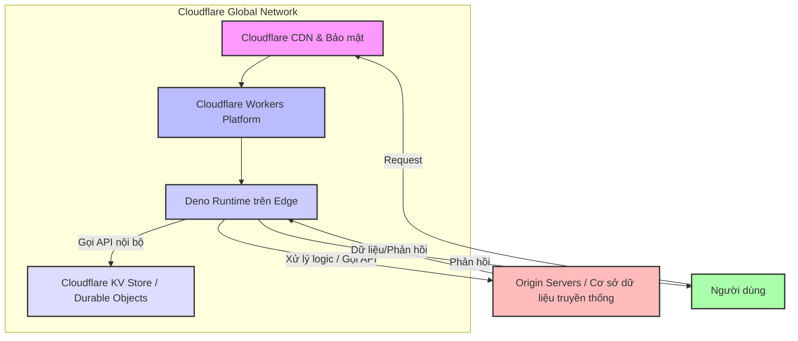

# Weekly Technology Intelligence Report (2026-41)

Generated: Sat, 10 Oct 2026 08:14:50 GMT

## 🏷️ Key Topics & Tags

`AI`  `SOFTWARE DEVELOPMENT`  `SECURITY`  `HARDWARE`  `WEB TECHNOLOGIES`  `REVERSE ENGINEERING`  `VR/AR`

## 🤖 AI Trend Analysis

# 📊 Tổng Quan

Dựa trên dữ liệu thu thập từ GitHub Trending và Hacker News hôm nay, có thể thấy một số xu hướng công nghệ nổi bật đang định hình cách chúng ta phát triển phần mềm và tương tác với các hệ thống.

### Top 5 Công Nghệ / Dự Án Đáng Chú Ý

1.  **claude-mem (GitHub Score: 99057)**: Một giải pháp giúp AI agent có "trí nhớ" dai dẳng bằng cách ghi lại, nén ngữ cảnh và tái sử dụng trong các phiên làm việc tương lai.
2.  **Agent-Reach (GitHub Score: 95173)**: Cung cấp khả năng "nhìn thấy" toàn bộ internet cho AI agent, cho phép chúng đọc và tìm kiếm trên nhiều nền tảng mà không tốn phí API.
3.  **hyperframes (GitHub Score: 59985)**: Cho phép tạo video từ HTML, được xây dựng đặc biệt cho các agent. Dự án này mở ra tiềm năng tạo nội dung đa phương tiện tự động bởi AI.
4.  **Cloudflare acquires Deno (Hacker News Score: 1192)**: Tin tức quan trọng về việc Cloudflare mua lại Deno, một runtime JavaScript/TypeScript. Đây là một sự kiện lớn trong lĩnh vực hạ tầng và phát triển web, đặc biệt là Edge Computing.
5.  **openGym (GitHub Score: 8862)**: Ứng dụng theo dõi tập luyện tự host, ưu tiên dữ liệu cá nhân trên server riêng của người dùng.

### Vì sao chúng đang nổi lên

*   **Sự bùng nổ của AI Agent**: Các dự án như `claude-mem`, `Agent-Reach`, `hyperframes` cho thấy một sự chuyển dịch mạnh mẽ sang mô hình AI Agent có khả năng tự chủ, tương tác với thế giới thực và thực hiện các tác vụ phức tạp. Vấn đề về ngữ cảnh dài hạn và khả năng truy cập thông tin bên ngoài là những rào cản lớn mà các dự án này đang cố gắng giải quyết.
*   **Xu hướng Self-hosting & Quyền riêng tư dữ liệu**: `openGym` thể hiện nhu cầu ngày càng tăng của người dùng trong việc kiểm soát dữ liệu cá nhân của họ, tránh phụ thuộc vào các dịch vụ đám mây lớn.
*   **Củng cố hạ tầng và Edge Computing**: Việc Cloudflare mua lại Deno cho thấy tầm quan trọng của các runtime hiệu quả và an toàn cho việc xây dựng ứng dụng trên nền tảng Edge Computing, nơi hiệu năng và độ trễ là tối quan trọng.

### Ai nên quan tâm

*   **Kỹ sư Backend**: Để hiểu cách thiết kế API cho AI agent, quản lý dữ liệu phi cấu trúc (ngữ cảnh), và các mô hình triển khai ứng dụng trên Edge.
*   **Người yêu thích System Design**: Để nghiên cứu kiến trúc của các hệ thống AI Agent phức tạp, cách giải quyết bài toán về bộ nhớ, khả năng mở rộng.
*   **Người học Cloud / DevOps**: Để theo dõi các xu hướng về nền tảng serverless, Edge Computing, và quản lý hạ tầng cho các ứng dụng mới.
*   **Người học SRE**: Để hiểu các thách thức về độ tin cậy, hiệu năng và khả năng quan sát của các hệ thống AI Agent và Edge.

### Dự án được chọn để phân tích chuyên sâu

Chúng tôi sẽ chọn hai chủ đề để phân tích chuyên sâu:

1.  **claude-mem**: Lý do chọn là vì nó giải quyết một vấn đề cốt lõi của việc xây dựng AI Agent thông minh và hữu ích (quản lý ngữ cảnh/bộ nhớ dài hạn), một thách thức kỹ thuật có nhiều ý nghĩa về kiến trúc hệ thống và xử lý dữ liệu.
2.  **Cloudflare acquires Deno**: Đây là một sự kiện lớn về hạ tầng, trực tiếp ảnh hưởng đến các lựa chọn công nghệ cho kỹ sư backend và DevOps, đặc biệt trong bối cảnh Edge Computing và serverless đang phát triển mạnh mẽ.

---

# 🔥 Phân Tích Chuyên Sâu

## claude-mem

### Mô tả

`claude-mem` là một công cụ giúp các AI agent (như Claude, Copilot, Gemini, v.v.) có khả năng ghi nhớ thông tin xuyên suốt các phiên làm việc. Nó hoạt động bằng cách tự động ghi lại tất cả các tương tác (input và output của agent), sau đó nén chúng lại bằng AI và tái inject các ngữ cảnh liên quan vào các phiên làm việc trong tương lai, giúp agent "nhớ" những gì đã làm và học được trước đó.

### URL

Không có URL trực tiếp được cung cấp, nhưng dự án được liệt kê là `thedotmack / claude-mem` trên GitHub.
Giả định URL: `https://github.com/thedotmack/claude-mem`

### Tại sao đang nổi bật

Dự án này nổi bật với điểm số GitHub cực cao (99057 sao), cho thấy sự quan tâm rất lớn từ cộng đồng. Nó giải quyết một vấn đề cốt lõi và cấp bách trong phát triển AI Agent: giới hạn ngữ cảnh (context window) của các Large Language Model (LLM). Hầu hết các LLM chỉ có thể xử lý một lượng văn bản nhất định tại một thời điểm. `claude-mem` cung cấp một giải pháp thực tế để vượt qua hạn chế này, giúp agent có vẻ thông minh và liên tục hơn, đồng thời giảm chi phí gọi API vì không cần truyền lại toàn bộ lịch sử.

### Nguyên lý cơ bản

Nguyên lý cơ bản của `claude-mem` xoay quanh việc mô phỏng "bộ nhớ" dài hạn cho AI Agent. Các LLM hiện tại có một "bộ nhớ" ngắn hạn giới hạn bởi độ dài của prompt (context window). Khi prompt quá dài, chúng sẽ quên những thông tin cũ. `claude-mem` giải quyết điều này bằng kỹ thuật sau:

1.  **Ghi nhận hành vi**: Mọi tương tác của agent (input, output, công cụ sử dụng) đều được ghi lại.
2.  **Nén thông tin**: Thay vì lưu trữ toàn bộ lịch sử, hệ thống sử dụng một mô hình AI khác (hoặc các kỹ thuật embeddings) để tóm tắt hoặc trích xuất các thông tin quan trọng từ lịch sử này, tạo ra một "bản tóm tắt" hay "ký ức" cô đọng.
3.  **Truy xuất thông minh**: Khi agent cần thực hiện một tác vụ mới, hệ thống sẽ tìm kiếm trong các "ký ức" đã nén để tìm những thông tin liên quan nhất và đưa chúng vào prompt hiện tại. Điều này giúp agent có ngữ cảnh đầy đủ mà không vượt quá giới hạn token của LLM.

Cách tiếp cận này khác với cách truyền thống (chỉ truyền lịch sử trò chuyện trực tiếp) ở chỗ nó thông minh hơn trong việc chọn lọc và tóm tắt thông tin, giúp agent duy trì sự liên tục mà không làm tăng prompt size một cách vô hạn.

### Cơ chế hoạt động

Hệ thống `claude-mem` có thể được hình dung qua các bước sau:

1.  **Capture Interaction**: Khi người dùng tương tác với AI Agent, hoặc khi agent thực hiện một hành động (gọi công cụ, sinh code), tất cả input và output sẽ được module `Mem Capture` ghi lại.
2.  **Store Raw Data**: Dữ liệu thô này (ví dụ: cuộc trò chuyện, kết quả lệnh) được lưu trữ vào một **Bộ nhớ dài hạn** (có thể là cơ sở dữ liệu phi quan hệ như MongoDB, một Vector Database, hoặc đơn giản là file JSON/text).
3.  **Context Compression**: Định kỳ hoặc sau một ngưỡng tương tác nhất định, một **AI Context Compressor** sẽ đọc dữ liệu từ Bộ nhớ dài hạn. Module này sử dụng một LLM phụ hoặc thuật toán tóm tắt để nén thông tin, tạo ra các "ký ức" cô đọng hoặc các embedding vector. Các ký ức đã nén này sau đó được lưu trữ trở lại vào Bộ nhớ dài hạn, thường đi kèm với các metadata (thời gian, chủ đề).
4.  **Context Retrieval**: Khi người dùng bắt đầu một phiên làm việc mới hoặc agent cần ngữ cảnh để ra quyết định, một **Context Retrieval Module** sẽ phân tích yêu cầu hiện tại. Nó sẽ truy vấn Bộ nhớ dài hạn (sử dụng tìm kiếm theo vector similarity nếu có embedding, hoặc tìm kiếm từ khóa) để tìm các "ký ức" hoặc ngữ cảnh đã nén có liên quan nhất.
5.  **Prompt Injection**: Các ngữ cảnh liên quan được truy xuất sẽ được inject (chèn) vào phần đầu của prompt (lời nhắc) trước khi gửi tới AI Agent chính (Claude, Copilot, v.v.). Điều này cung cấp cho agent thông tin nền cần thiết để thực hiện tác vụ một cách thông minh và có tính liên tục.

### Sơ đồ kiến trúc (HLD)

```mermaid
graph TD
    A[Người dùng] --> B{Giao tiếp với Agent};
    B -- Input/Output --> C[AI Agent (Claude, Copilot, etc.)];
    C -- Logs/Interactions --> D[Mem Capture Module];
    D -- Lưu trữ Raw Data --> E[Bộ nhớ dài hạn (Vector DB / NoSQL DB)];
    E -- Định kỳ/Theo yêu cầu --> F[AI Context Compressor (sử dụng LLM phụ)];
    F -- Ngữ cảnh đã nén/Embeddings --> E;
    C -- Yêu cầu Context --> G[Context Retrieval Module];
    G -- Tìm kiếm Context liên quan --> E;
    G -- Ngữ cảnh phù hợp --> H[Prompt Builder];
    H -- Inject vào Prompt --> C;
```

*   **Người dùng**: Thực hiện các yêu cầu hoặc tương tác với AI Agent.
*   **AI Agent**: Mô hình AI chính (ví dụ: Claude) thực hiện các tác vụ và giao tiếp.
*   **Mem Capture Module**: Module chịu trách nhiệm ghi lại toàn bộ các tương tác và hành động của AI Agent.
*   **Bộ nhớ dài hạn (Vector DB / NoSQL DB)**: Nơi lưu trữ dữ liệu thô và các ngữ cảnh đã nén. Vector Database rất phù hợp để lưu trữ embeddings và tìm kiếm theo độ tương đồng ngữ nghĩa.
*   **AI Context Compressor**: Sử dụng một LLM khác hoặc thuật toán để tóm tắt, nén các tương tác thô thành "ký ức" cô đọng hoặc embedding vector.
*   **Context Retrieval Module**: Khi AI Agent cần thông tin, module này tìm kiếm trong Bộ nhớ dài hạn để lấy ra các ngữ cảnh liên quan nhất.
*   **Prompt Builder**: Chèn các ngữ cảnh đã truy xuất vào prompt hiện tại, tạo ra một prompt phong phú hơn cho AI Agent.

### Có thể áp dụng vào dự án như thế nào?

1.  **Hệ thống Chatbot Chăm sóc Khách hàng thông minh**: Thay vì mỗi lần khách hàng tương tác là một phiên mới, chatbot có thể "nhớ" lịch sử các vấn đề trước đó, sở thích của khách hàng, các sản phẩm đã mua, giúp cung cấp hỗ trợ cá nhân hóa và hiệu quả hơn.
2.  **Trợ lý lập trình AI (Code Assistant) cấp doanh nghiệp**: Một AI assistant có thể ghi nhớ toàn bộ kiến trúc codebase của công ty, các quyết định thiết kế trước đây, các convention đã thống nhất, giúp developer mới nhanh chóng nắm bắt và đảm bảo tính nhất quán trong code.
3.  **Hệ thống Tự động hóa Tác vụ Vận hành (DevOps/SRE)**: AI Agent có thể ghi nhớ các sự cố từng xảy ra, các giải pháp đã được áp dụng, các thay đổi cấu hình, giúp tự động hóa việc phân tích lỗi, đề xuất giải pháp và thậm chí tự động khắc phục các sự cố lặp lại.

### Tips áp dụng ngay trong công việc

1.  **Thiết kế tầng Persistent Context (Bộ nhớ ngữ cảnh dai dẳng)**: Khi xây dựng các ứng dụng có tích hợp AI, hãy nghĩ đến việc thêm một tầng lưu trữ đặc biệt cho ngữ cảnh. Sử dụng cơ sở dữ liệu phù hợp (Vector DB như Qdrant, Milvus hoặc NoSQL DB như MongoDB, Cassandra) để lưu trữ các tương tác và "ký ức" của AI.
2.  **Chiến lược nén/tóm tắt dữ liệu**: Áp dụng các kỹ thuật tóm tắt (summarization) hoặc tạo embedding cho các đoạn hội thoại dài hoặc log hoạt động. Điều này giúp giảm chi phí token khi gọi LLM và cải thiện hiệu quả truy xuất thông tin.
3.  **Tối ưu hóa truy xuất thông tin (Retrieval Augmented Generation - RAG)**: Khi AI Agent cần thông tin, thay vì truyền toàn bộ lịch sử, hãy thiết kế một cơ chế thông minh để tìm kiếm và chỉ truyền những thông tin *liên quan nhất* từ bộ nhớ dài hạn của bạn vào prompt. Điều này là cốt lõi của RAG, giúp AI tạo ra phản hồi chính xác và cập nhật hơn.
4.  **Giới hạn cửa sổ ngữ cảnh (Context Window)**: Khi thiết kế prompt, hãy luôn ý thức về giới hạn token của LLM bạn đang sử dụng. Nén hoặc chọn lọc thông tin là cách tốt nhất để đảm bảo prompt luôn nằm trong giới hạn mà vẫn hiệu quả.

### Bài tập thực hành (1 buổi tối hoặc 1 cuối tuần)

**Xây dựng Chatbot có "trí nhớ" cơ bản**

*   **Mục tiêu**: Hiểu cách duy trì ngữ cảnh cho một chatbot đơn giản mà không dùng các kỹ thuật AI phức tạp.
*   **Công cụ/Stack cần thiết**: Python, thư viện `transformers` (cho mô hình tóm tắt đơn giản), file JSON hoặc SQLite database.
*   **Các bước chính**:
    1.  **Khởi tạo dự án**: Tạo một ứng dụng Python console.
    2.  **Module Chatbot**: Viết hàm `chat(user_input, history)` giả lập phản hồi của chatbot. Ban đầu, nó chỉ phản hồi dựa trên `user_input` hiện tại.
    3.  **Module Ghi nhớ**:
        *   Tạo một list hoặc cấu trúc dữ liệu để lưu trữ `(user_input, chatbot_response)` của mỗi lượt.
        *   Khi `history` (list tương tác) đạt đến một kích thước nhất định (ví dụ: 5-10 lượt), bạn có thể "tóm tắt" nó.
        *   Sử dụng một mô hình tóm tắt nhỏ (ví dụ: `T5-small` từ `transformers`) để tóm tắt các cuộc trò chuyện cũ thành một câu ngắn. Lưu bản tóm tắt này vào một file JSON hoặc SQLite DB.
    4.  **Tích hợp "trí nhớ"**: Trước mỗi lần gọi `chat`, hãy đọc bản tóm tắt gần nhất (nếu có) từ file/DB và thêm nó vào đầu `user_input` dưới dạng ngữ cảnh cho chatbot.
    5.  **Thử nghiệm**: Trò chuyện với chatbot, xem nó có "nhớ" được các chủ đề đã nói trước đó không.
*   **Kết quả mong đợi**: Một chatbot đơn giản có thể duy trì một dạng ngữ cảnh qua các phiên trò chuyện bằng cách tóm tắt và tái sử dụng thông tin cũ.

### Ưu điểm

*   **Cải thiện trải nghiệm người dùng**: AI Agent có khả năng nhớ giúp tương tác tự nhiên, thông minh và hiệu quả hơn.
*   **Giảm chi phí API**: Bằng cách nén và chỉ truyền ngữ cảnh liên quan, số lượng token được gửi đến LLM giảm đi đáng kể, tiết kiệm chi phí.
*   **Vượt qua giới hạn Context Window**: Cho phép các agent xử lý các tác vụ phức tạp, dài hạn mà các LLM tiêu chuẩn không thể làm được.
*   **Tăng tính nhất quán**: Agent có thể duy trì sự nhất quán trong các quyết định và hành động dựa trên lịch sử đã học.

### Nhược điểm

*   **Độ phức tạp trong triển khai**: Thiết lập và quản lý hệ thống ghi nhớ, nén, truy xuất ngữ cảnh đòi hỏi kiến thức về kiến trúc dữ liệu, NLP và tích hợp LLM.
*   **Chi phí tính toán**: Việc nén và truy xuất ngữ cảnh bằng AI vẫn tốn tài nguyên và có thể phát sinh chi phí cho các mô hình AI phụ trợ.
*   **Độ trễ tiềm ẩn**: Quá trình truy xuất và chèn ngữ cảnh có thể làm tăng độ trễ trong phản hồi của agent.
*   **Rủi ro sai lệch thông tin**: Việc tóm tắt hoặc chọn lọc ngữ cảnh có thể vô tình loại bỏ thông tin quan trọng hoặc tạo ra thông tin sai lệch nếu không được thiết kế cẩn thận.

---

## Cloudflare acquires Deno

### Mô tả

Cloudflare đã chính thức mua lại Deno, một runtime JavaScript/TypeScript hiện đại, an toàn và được thiết kế bởi Ryan Dahl, người tạo ra Node.js. Deno nổi bật với việc hỗ trợ TypeScript nguyên bản, tích hợp Web APIs, và mô hình bảo mật dựa trên quyền hạn (permissions) mặc định. Thương vụ này được kỳ vọng sẽ tăng cường khả năng của Cloudflare trong lĩnh vực Edge Computing và phát triển ứng dụng server-side với JavaScript/TypeScript.

### URL

Tin tức này xuất hiện trên Hacker News với tiêu đề `Cloudflare acquires Deno`.

### Tại sao đang nổi bật

Tin tức này có điểm số cao nhất trên Hacker News (1192), cho thấy sự quan tâm rất lớn từ cộng đồng kỹ thuật. Sự kiện này nổi bật vì:

*   **Hai tên tuổi lớn**: Cloudflare là một "ông lớn" trong lĩnh vực CDN, bảo mật và Edge Computing. Deno là một runtime đang lên, được cộng đồng đánh giá cao về các cải tiến so với Node.js.
*   **Tầm ảnh hưởng đến hệ sinh thái JavaScript**: Đây là một sự kiện quan trọng có thể định hình tương lai của JavaScript/TypeScript ở phía server-side và Edge.
*   **Tăng cường Edge Computing**: Deno với thiết kế gọn nhẹ, hiệu suất cao và bảo mật vốn đã rất phù hợp cho Edge Computing. Việc tích hợp sâu vào nền tảng của Cloudflare có thể tạo ra một hệ sinh thái mạnh mẽ cho các nhà phát triển xây dựng ứng dụng trên Edge.

### Nguyên lý cơ bản

**Deno Runtime**: Deno được xây dựng dựa trên V8 engine của Google Chrome (giống Node.js) nhưng với những triết lý thiết kế khác biệt:
*   **TypeScript nguyên bản**: Không cần cài đặt trình biên dịch TypeScript riêng.
*   **Bảo mật mặc định**: Mọi truy cập file, network đều cần quyền rõ ràng, giảm thiểu rủi ro bảo mật.
*   **Tích hợp Web APIs**: Cố gắng tuân thủ các Web API tiêu chuẩn (như `fetch`, `Worker`) thay vì các API riêng.
*   **Module ES**: Hỗ trợ module ES6, không cần `node_modules`.

**Cloudflare Workers**: Là nền tảng serverless của Cloudflare, cho phép chạy code JavaScript/TypeScript trên mạng lưới phân tán toàn cầu của họ, tại các "Edge location" gần người dùng cuối.

Sự kết hợp này nhằm mục đích tận dụng ưu điểm của Deno (hiệu suất, bảo mật, trải nghiệm dev hiện đại) trên nền tảng Edge mạnh mẽ của Cloudflare. Điều này giúp các nhà phát triển dễ dàng viết và triển khai các ứng dụng chạy rất gần người dùng, giảm đáng kể độ trễ.

### Cơ chế hoạt động

Sau thương vụ sáp nhập, Deno không chỉ đơn thuần là một runtime độc lập mà còn có thể được tích hợp sâu hơn vào hệ sinh thái của Cloudflare.

1.  **Phát triển ứng dụng Deno**: Nhà phát triển viết ứng dụng backend hoặc API bằng TypeScript/JavaScript sử dụng Deno. Mã nguồn có thể tận dụng các tính năng của Deno như Web APIs và hệ thống module.
2.  **Deploy lên Cloudflare Workers**: Thay vì triển khai lên một server truyền thống, ứng dụng Deno được đóng gói và triển khai lên nền tảng Cloudflare Workers.
3.  **Thực thi trên Edge**: Khi người dùng gửi một request, request đó sẽ được định tuyến đến Edge location của Cloudflare gần nhất. Tại đây, môi trường Deno runtime đã được tích hợp sẽ khởi chạy và thực thi code của ứng dụng.
4.  **Xử lý Request độ trễ thấp**: Ứng dụng Deno trên Edge xử lý request, có thể tương tác với các dịch vụ khác của Cloudflare (như KV store, Durable Objects) hoặc gọi về các Origin Servers truyền thống nếu cần dữ liệu phức tạp.
5.  **Phản hồi nhanh chóng**: Kết quả được trả về cho người dùng từ Edge location, đảm bảo độ trễ cực thấp.

### Sơ đồ kiến trúc (HLD)



*   **Người dùng**: Người dùng cuối gửi yêu cầu đến ứng dụng.
*   **Cloudflare CDN & Bảo mật**: Lớp đầu tiên của Cloudflare xử lý request, cung cấp bảo mật và caching.
*   **Cloudflare Workers Platform**: Nền tảng serverless nơi các ứng dụng được triển khai và quản lý.
*   **Deno Runtime trên Edge**: Môi trường Deno được tích hợp và chạy trực tiếp trên các máy chủ Edge của Cloudflare, thực thi mã ứng dụng.
*   **Cloudflare KV Store / Durable Objects**: Các dịch vụ lưu trữ dữ liệu phân tán, có độ trễ thấp của Cloudflare, có thể được ứng dụng Deno sử dụng trực tiếp trên Edge.
*   **Origin Servers / Cơ sở dữ liệu truyền thống**: Các máy chủ backend hoặc cơ sở dữ liệu "gốc" nơi chứa dữ liệu chính hoặc logic nghiệp vụ phức tạp mà ứng dụng Edge có thể cần truy cập.

### Có thể áp dụng vào dự án như thế nào?

1.  **API Gateway hoặc Microservices trên Edge**: Triển khai các API đơn giản, logic xác thực, ủy quyền, hoặc các microservices tính toán nhẹ trực tiếp trên Cloudflare Workers với Deno để giảm độ trễ cho người dùng toàn cầu. Ví dụ: một API kiểm tra token đăng nhập trước khi chuyển tiếp request đến backend chính.
2.  **Xử lý Dữ liệu Frontend (Frontend Data Transformation)**: Các tác vụ như A/B testing, tùy chỉnh nội dung, hoặc chuyển đổi dữ liệu trước khi đến frontend có thể được thực hiện trên Edge, cải thiện tốc độ tải trang và trải nghiệm người dùng.
3.  **Backend cho Ứng dụng Real-time/IoT**: Với khả năng xử lý độ trễ thấp, Deno trên Edge có thể là lựa chọn tốt để xử lý dữ liệu từ các thiết bị IoT hoặc các tương tác real-time yêu cầu phản hồi nhanh.

### Tips áp dụng ngay trong công việc

1.  **Nghiên cứu kiến trúc Edge Computing**: Tìm hiểu cách thức hoạt động của Cloudflare Workers, Deno Deploy và các dịch vụ Edge khác. Hiểu rõ ưu nhược điểm của việc chạy code trên Edge so với server truyền thống để đưa ra quyết định kiến trúc phù hợp.
2.  **Làm quen với Deno**: Dành thời gian học cú pháp, hệ thống module (ESM), cách quản lý quyền (permissions) và các Web APIs mà Deno cung cấp. Đây là một runtime có nhiều cải tiến về mặt phát triển và bảo mật.
3.  **Thiết kế ứng dụng Serverless/Stateless**: Khi phát triển cho môi trường Edge (như Workers), luôn ưu tiên thiết kế các hàm hoặc microservice không có trạng thái (stateless), khởi động nhanh để tận dụng tối đa lợi ích của serverless.
4.  **Tận dụng công nghệ phân tán**: Tìm hiểu về các dịch vụ như Cloudflare KV Store (key-value store), Durable Objects (stateful serverless), hoặc R2 (object storage) để lưu trữ dữ liệu một cách phân tán, phù hợp với kiến trúc Edge.

### Bài tập thực hành (1 buổi tối hoặc 1 cuối tuần)

**Xây dựng API đơn giản với Deno và triển khai (giả định) trên Edge**

*   **Mục tiêu**: Hiểu cách viết một API cơ bản bằng Deno và hình dung việc deploy nó lên một nền tảng Edge Computing.
*   **Công cụ/Stack cần thiết**: Deno Runtime, một trình soạn thảo mã (VS Code), `curl` hoặc Postman để kiểm tra API.
*   **Các bước chính**:
    1.  **Cài đặt Deno**: Làm theo hướng dẫn trên trang web của Deno để cài đặt runtime.
    2.  **Viết API đơn giản**: Tạo một file `api.ts` hoặc `api.js` với nội dung sau:
        ```typescript
        import { serve } from "https://deno.land/std@0.224.0/http/server.ts";

        async function handler(req: Request): Promise<Response> {
            const url = new URL(req.url);
            if (url.pathname === "/hello") {
                return new Response("Hello from Deno on Edge!", {
                    headers: { "content-type": "text/plain" },
                });
            } else if (url.pathname === "/json") {
                return new Response(JSON.stringify({ message: "Welcome to Deno API", timestamp: new Date() }), {
                    headers: { "content-type": "application/json" },
                });
            }
            return new Response("Not Found", { status: 404 });
        }

        console.log("Deno API Server running on http://localhost:8000");
        serve(handler, { port: 8000 });
        ```
    3.  **Chạy ứng dụng Deno**: Mở terminal và chạy `deno run --allow-net api.ts`. `deno` sẽ tự động tải các module cần thiết.
    4.  **Kiểm tra API**: Sử dụng `curl http://localhost:8000/hello` và `curl http://localhost:8000/json` để xem kết quả.
    5.  **(Tùy chọn) Nghiên cứu Deno Deploy**: Nếu có tài khoản Cloudflare hoặc Deno Deploy, hãy thử deploy ứng dụng này lên đó. Nếu không, hãy đọc tài liệu về cách họ deploy để hiểu quy trình.
*   **Kết quả mong đợi**: Một API đơn giản bằng Deno hoạt động cục bộ, và bạn có cái nhìn cơ bản về cách nó có thể được triển khai và chạy trên môi trường Edge.

### Ưu điểm

*   **Hiệu năng cao**: Deno sử dụng V8 engine và được thiết kế để khởi động nhanh, thực thi hiệu quả, lý tưởng cho Edge Computing.
*   **Bảo mật vượt trội**: Mô hình bảo mật dựa trên quyền hạn (permissions) của Deno giúp giảm thiểu rủi ro từ mã độc hoặc lỗi.
*   **Trải nghiệm phát triển hiện đại**: Hỗ trợ TypeScript nguyên bản, tích hợp Web APIs, và hệ thống module sạch giúp tăng năng suất developer.
*   **Phù hợp với Edge Computing**: Thiết kế của Deno giúp nó hoạt động tốt trong môi trường phân tán, độ trễ thấp.
*   **Tích hợp sâu với Cloudflare**: Tiềm năng tận dụng toàn bộ hệ sinh thái của Cloudflare (CDN, bảo mật, lưu trữ) một cách liền mạch.

### Nhược điểm

*   **Hệ sinh thái còn non trẻ**: So với Node.js, hệ sinh thái thư viện và công cụ của Deno vẫn còn nhỏ hơn.
*   **Khả năng lock-in**: Mặc dù Deno là mã nguồn mở, việc tích hợp sâu với Cloudflare có thể dẫn đến sự phụ thuộc vào nền tảng này cho các ứng dụng Edge.
*   **Thay đổi nhanh chóng**: Là một công nghệ tương đối mới, Deno có thể trải qua nhiều thay đổi API hoặc cách thức hoạt động.
*   **Học đường cong**: Các nhà phát triển quen với Node.js sẽ cần điều chỉnh để làm quen với mô hình module, cách quản lý dependency và bảo mật của Deno.

---

# 💬 Các Chủ Đề Đang Được Thảo Luận

Các cuộc thảo luận trên Hacker News và GitHub Trending ngày hôm nay xoay quanh một số chủ đề chính:

*   **AI Agent và khả năng của chúng**:
    *   **"Trí nhớ" và ngữ cảnh dài hạn**: Các dự án như `claude-mem` và `openrig` làm nổi bật nhu cầu cấp thiết về việc cung cấp cho AI agent khả năng duy trì ngữ cảnh qua các phiên. Kỹ sư đang thảo luận về các cách hiệu quả để nén thông tin, lưu trữ "ký ức" và truy xuất thông tin liên quan mà không làm quá tải context window của LLM hoặc phát sinh chi phí quá lớn. Đây là một thách thức kỹ thuật lớn về kiến trúc dữ liệu và xử lý ngôn ngữ tự nhiên.
    *   **Khả năng tương tác với "thế giới thực"**: `Agent-Reach` (AI agent có "mắt" để đọc internet), `text-to-cad` (AI agent có khả năng thiết kế CAD), `hyperframes` (AI agent tạo video từ HTML) cho thấy xu hướng tích hợp AI agent với các công cụ và nền tảng bên ngoài để thực hiện các tác vụ phức tạp hơn. Thảo luận xoay quanh việc thiết kế các API và giao diện để agent có thể sử dụng các công cụ này một cách an toàn và hiệu quả.
    *   **Tổ chức và hợp tác giữa các agent**: `openrig` (xây dựng mạng lưới agent với vai trò, ngữ cảnh chia sẻ) chỉ ra sự quan tâm đến việc tạo ra các "đội" AI agent có thể cộng tác để giải quyết các vấn đề lớn. Các kỹ sư đang cân nhắc cách điều phối, giao tiếp và quản lý trạng thái giữa các agent.

*   **Hạ tầng và Runtime**:
    *   **Cloudflare mua Deno**: Đây là một chủ đề nóng, được thảo luận rộng rãi về tương lai của Deno, Cloudflare Workers, và Edge Computing. Nhiều người suy đoán về việc Deno sẽ trở thành runtime tiêu chuẩn cho Workers, tiềm năng cạnh tranh với Node.js và các dịch vụ FaaS khác. Các kỹ sư backend và DevOps đặc biệt quan tâm đến việc liệu Deno có đủ trưởng thành và hệ sinh thái có đủ lớn để thay thế Node.js trong các dự án quy mô lớn.
    *   **Các công cụ gỡ lỗi và biên dịch**: `raddebugger` (bộ gỡ lỗi đồ họa đa tiến trình) và `Compiling Rust to readable C with Eurydice` cho thấy sự quan tâm liên tục đến các công cụ developer, đặc biệt là những công cụ giúp hiểu và gỡ lỗi các hệ thống phức tạp, hoặc chuyển đổi mã giữa các ngôn ngữ.

*   **Quyền riêng tư dữ liệu và Self-hosting**:
    *   `openGym` (self-hosted gym tracker) và `Proton Drive for Linux` là các dự án nổi bật, thể hiện xu hướng người dùng muốn kiểm soát dữ liệu của họ, thay vì phụ thuộc hoàn toàn vào các dịch vụ đám mây lớn. Điều này đặt ra các yêu cầu về khả năng đồng bộ hóa dữ liệu (nếu có), sao lưu và bảo mật cho các ứng dụng self-hosted.

*   **Bảo mật và lỗ hổng**:
    *   `Telegram Desktop vulnerability allowed any user's file to be stolen` là lời nhắc nhở về tầm quan trọng của bảo mật trong phát triển phần mềm, đặc biệt là các ứng dụng giao tiếp.

---

# 🏗️ Xu Hướng Kiến Trúc & Kỹ Thuật

Dựa trên dữ liệu thu thập, các khái niệm kiến trúc và kỹ thuật nổi bật bao gồm:

*   **AI Agents**:
    *   **Là gì**: AI Agents là các hệ thống AI được thiết kế để tự động thực hiện các tác vụ, ra quyết định và tương tác với môi trường bên ngoài (bao gồm internet, ứng dụng khác, hoặc thậm chí các agent khác) mà không cần sự can thiệp liên tục của con người. Chúng thường được xây dựng dựa trên Large Language Models (LLM) và được trang bị các công cụ (tools) để mở rộng khả năng.
    *   **Tại sao quan trọng với backend/DevOps/SRE**:
        *   **Backend**: Cần thiết kế API và hệ thống backend có thể tương tác hiệu quả với các agent (API cho công cụ của agent, lưu trữ ngữ cảnh, quản lý trạng thái).
        *   **DevOps/SRE**: AI Agents có tiềm năng lớn trong việc tự động hóa các tác vụ vận hành (tự động phân tích log, phát hiện bất thường, triển khai phần mềm, khắc phục sự cố), đòi hỏi hệ thống phải có khả năng quan sát và điều khiển agent.

*   **Local-first**:
    *   **Là gì**: Một triết lý thiết kế ứng dụng nơi dữ liệu chính được ưu tiên lưu trữ cục bộ trên thiết bị của người dùng. Các thay đổi được thực hiện cục bộ trước, sau đó đồng bộ hóa với server (nếu có) một cách không đồng bộ. Điều này mang lại trải nghiệm nhanh hơn, khả năng làm việc offline và quyền kiểm soát dữ liệu cao hơn cho người dùng.
    *   **Tại sao quan trọng với backend/DevOps/SRE**:
        *   **Backend**: Cần xây dựng các API và dịch vụ đồng bộ hóa dữ liệu mạnh mẽ, có khả năng giải quyết xung đột khi dữ liệu được thay đổi ở nhiều nơi.
        *   **DevOps/SRE**: Đảm bảo tính nhất quán và độ tin cậy của dữ liệu trên cả client và server, quản lý lưu trữ dữ liệu phân tán.

*   **Edge Computing**:
    *   **Là gì**: Một mô hình tính toán phân tán đưa khả năng xử lý dữ liệu và ứng dụng đến gần nguồn dữ liệu hơn hoặc gần người dùng cuối hơn (tại "Edge" của mạng) thay vì tập trung ở một datacenter trung tâm. Mục tiêu là giảm độ trễ, tiết kiệm băng thông và tăng cường bảo mật.
    *   **Tại sao quan trọng với backend/DevOps/SRE**:
        *   **Backend**: Yêu cầu thiết kế các microservice hoặc function stateless, nhẹ, có khả năng khởi động nhanh để chạy hiệu quả trên Edge.
        *   **DevOps/SRE**: Cần quản lý việc triển khai, giám sát và mở rộng các ứng dụng trên một mạng lưới phân tán rộng lớn (ví dụ: Cloudflare Workers), đảm bảo độ tin cậy và hiệu năng toàn cầu.

---

# 🎯 Gợi Ý Học Tập

## Nên học ngay

1.  **Kiến trúc AI Agent và Quản lý Ngữ cảnh**:
    *   **Lý do**: Với sự nổi lên mạnh mẽ của AI Agent (thể hiện qua `claude-mem`, `Agent-Reach`, `hyperframes`), việc hiểu cách xây dựng, thiết kế "bộ nhớ" dài hạn và cách tích hợp công cụ cho agent là kỹ năng rất cần thiết.
    *   **Nội dung**: Tìm hiểu về Retrieval Augmented Generation (RAG), cách sử dụng vector database, chiến lược tóm tắt/nén thông tin cho LLM, và cách thiết kế các API/plugins để agent tương tác với các hệ thống khác.

2.  **Deno Runtime và Edge Computing**:
    *   **Lý do**: Sự kiện Cloudflare mua Deno là một tín hiệu mạnh mẽ về hướng đi của JavaScript/TypeScript trên server và Edge Computing. Nắm vững Deno và cách thức hoạt động của các nền tảng Edge như Cloudflare Workers sẽ mở ra nhiều cơ hội.
    *   **Nội dung**: Học cú pháp Deno, TypeScript, các Web APIs, và thực hành triển khai ứng dụng serverless trên các nền tảng Edge để hiểu về tối ưu hóa độ trễ và quản lý tài nguyên.

## Nên theo dõi

1.  **Phát triển công cụ gỡ lỗi (Debugger) đa tiến trình/đồ họa**:
    *   **Lý do**: `raddebugger` cho thấy sự cần thiết của các công cụ mạnh mẽ hơn để gỡ lỗi trong các hệ thống phân tán, phức tạp. Mặc dù có thể chưa áp dụng ngay, nhưng đây là một lĩnh vực đang phát triển.
    *   **Nội dung**: Theo dõi các dự án gỡ lỗi mã nguồn mở, đọc về các kỹ thuật gỡ lỗi trong môi trường phân tán (distributed debugging), và tìm hiểu cách các debugger tương tác với OS và runtime.

2.  **Công cụ tích hợp AI vào quy trình phát triển (IDE plugins)**:
    *   **Lý do**: `Cursor plugins` cho thấy AI sẽ tích hợp ngày càng sâu vào môi trường phát triển (IDE), tự động hóa nhiều tác vụ.
    *   **Nội dung**: Chú ý đến các cập nhật từ các IDE lớn (VS Code, IntelliJ) và các startup AI về cách họ tích hợp AI vào quy trình coding, review, và refactoring.

## Có dấu hiệu hype

1.  **Text-to-CAD (ví dụ: `text-to-cad`)**:
    *   **Lý do**: Ý tưởng tạo mô hình CAD từ văn bản có tiềm năng lớn, nhưng lĩnh vực thiết kế CAD rất phức tạp, đòi hỏi độ chính xác cao và hiểu biết sâu về vật lý. Các dự án hiện tại vẫn còn ở giai đoạn rất sớm và cần nhiều bằng chứng hơn về khả năng thực thi, độ tin cậy và khả năng sản xuất ra các mô hình CAD thực sự hữu ích. Việc tạo ra hình ảnh đơn giản là một chuyện, tạo ra bản vẽ kỹ thuật chi tiết, chính xác là một chuyện khác.
    *   **Khuyến nghị**: Nên theo dõi sự phát triển, nhưng chưa vội đầu tư thời gian học chuyên sâu hoặc kỳ vọng áp dụng ngay vào các dự án sản xuất.

---

# 💡 Ý Tưởng Side Project

Dưới đây là 5 ý tưởng side project lấy cảm hứng từ các xu hướng công nghệ ngày nay, tập trung vào Backend, DevOps, Infrastructure và AI Engineering.

1.  **Tên dự án**: Dịch vụ Bộ nhớ dài hạn cho AI Agent (Persistent AI Agent Memory Service)
    *   **Vấn đề giải quyết**: Các AI agent cần một nơi lưu trữ ngữ cảnh liên tục và có thể truy vấn hiệu quả. `claude-mem` chỉ là một công cụ; cần một dịch vụ backend chuyên dụng cho điều này.
    *   **Tech Stack gợi ý**:
        *   **Backend**: Python (FastAPI/Django) hoặc Node.js (Express)
        *   **Database**: Vector Database (Qdrant, Milvus, Weaviate) để lưu trữ embeddings và tìm kiếm ngữ nghĩa, kết hợp với PostgreSQL hoặc MongoDB để lưu trữ dữ liệu thô và metadata.
        *   **AI**: OpenAI API, Cohere API, hoặc Hugging Face (cho tạo embeddings và tóm tắt).
    *   **Độ khó**: Medium
    *   **Thời gian ước tính**: 2-3 cuối tuần
    *   **Mô tả**: Xây dựng một API service cung cấp các endpoint để ghi lại tương tác của agent, tạo embeddings/tóm tắt và lưu trữ vào Vector DB. API cũng sẽ có endpoint để truy vấn các ngữ cảnh liên quan dựa trên input mới của agent.

2.  **Tên dự án**: Nền tảng Theo dõi Sức khỏe Ứng dụng Self-hosted (Self-hosted Application Health Monitor)
    *   **Vấn đề giải quyết**: Giống như `openGym` cung cấp self-hosted cho việc tập luyện, nhiều nhà phát triển cá nhân hoặc nhóm nhỏ muốn theo dõi sức khỏe ứng dụng của họ mà không muốn dùng các dịch vụ SaaS đắt tiền.
    *   **Tech Stack gợi ý**:
        *   **Backend**: Go (Gin/Fiber) hoặc Rust (Actix-web/Rocket) để thu thập metrics hiệu quả.
        *   **Database**: Prometheus (để lưu trữ time-series data) hoặc ClickHouse (cho log analytics).
        *   **Frontend**: React/Vue/Svelte cho dashboard tương tác.
        *   **Infrastructure**: Docker Compose để dễ dàng triển khai.
    *   **Độ khó**: Medium
    *   **Thời gian ước tính**: 1-2 cuối tuần
    *   **Mô tả**: Xây dựng một ứng dụng cung cấp API để nhận metrics (CPU, RAM, HTTP requests) từ các ứng dụng/server của người dùng. Backend sẽ lưu trữ các metrics này và một frontend dashboard sẽ hiển thị chúng dưới dạng biểu đồ. Có thể thêm tính năng cảnh báo cơ bản.

3.  **Tên dự án**: Edge API Gateway với Deno và Cloudflare Workers
    *   **Vấn đề giải quyết**: Cần một API gateway có độ trễ cực thấp để xử lý các tác vụ như xác thực, định tuyến, rate limiting ngay tại Edge, giảm tải cho backend chính và tăng tốc độ phản hồi.
    *   **Tech Stack gợi ý**:
        *   **Runtime**: Deno
        *   **Platform**: Cloudflare Workers / Deno Deploy
        *   **Lưu trữ**: Cloudflare KV Store hoặc Durable Objects cho cấu hình/cache.
    *   **Độ khó**: Small (nếu chỉ làm chức năng cơ bản) đến Medium (nếu có nhiều tính năng)
    *   **Thời gian ước tính**: 1 cuối tuần
    *   **Mô tả**: Phát triển một ứng dụng Deno chạy trên Cloudflare Workers. Ứng dụng này sẽ nhận mọi request đến, kiểm tra token xác thực, áp dụng rate limiting (dùng KV Store), và sau đó định tuyến request đến backend gốc.

4.  **Tên dự án**: Công cụ Tự động hóa Deploy với AI Agent (AI Agent-powered Deployment Automation Tool)
    *   **Vấn đề giải quyết**: Tự động hóa và tối ưu hóa quy trình triển khai phần mềm (CI/CD) bằng cách cho phép một AI agent phân tích mã, phát hiện lỗi tiềm ẩn, và thậm chí đề xuất các bản cập nhật triển khai.
    *   **Tech Stack gợi ý**:
        *   **Backend**: Python (FastAPI) để điều khiển agent và tương tác với Git/CI/CD tools.
        *   **AI**: OpenAI API (hoặc các LLM khác) cho code analysis và ra quyết định.
        *   **CI/CD Integration**: Webhooks hoặc API của GitHub Actions, GitLab CI, Jenkins.
    *   **Độ khó**: Large
    *   **Thời gian ước tính**: 3-4 cuối tuần
    *   **Mô tả**: Xây dựng một dịch vụ lắng nghe các event từ Git repo (ví dụ: pull request). Khi có event, AI agent sẽ được kích hoạt để đọc code, đưa ra các gợi ý cải tiến, phát hiện lỗi tiềm ẩn hoặc thậm chí tự động tạo một pull request với các sửa lỗi nhỏ. Agent có thể dùng `Agent-Reach` để tìm kiếm giải pháp trên internet.

5.  **Tên dự án**: Hệ thống Tạo Video từ Văn bản/HTML cho Marketing (Text/HTML to Video Generator for Marketing)
    *   **Vấn đề giải quyết**: Các nhóm marketing thường cần tạo video quảng cáo nhanh chóng từ các nội dung có sẵn (text, hình ảnh, hoặc thậm chí HTML). `hyperframes` là một công cụ, nhưng cần một hệ thống backend để quản lý và tự động hóa.
    *   **Tech Stack gợi ý**:
        *   **Backend**: Node.js (NestJS) hoặc Python (FastAPI) để quản lý hàng đợi tác vụ và tương tác với `hyperframes` (hoặc các thư viện tạo video khác như `ffmpeg` wrapper).
        *   **Queue**: Redis Queue (RQ) hoặc RabbitMQ để xử lý các tác vụ tạo video không đồng bộ.
        *   **Storage**: S3-compatible object storage để lưu trữ video đã tạo.
        *   **Frontend**: Một UI đơn giản để người dùng nhập văn bản/HTML và xem kết quả.
    *   **Độ khó**: Medium
    *   **Thời gian ước tính**: 2 cuối tuần
    *   **Mô tả**: Người dùng tải lên văn bản hoặc HTML, chọn template, và hệ thống backend sẽ gửi yêu cầu tạo video vào một hàng đợi. Worker sẽ sử dụng `hyperframes` (hoặc một công cụ tương tự) để render video, sau đó lưu trữ video kết quả và thông báo cho người dùng.

## 🌟 Top GitHub Trending Repositories

1. **[mattpocock / skills](https://github.com/mattpocock/skills)** — Skills for Real Engineers. Straight from my .agents directory. [Shell] _(283312 stars)_
2. **[thedotmack / claude-mem](https://github.com/thedotmack/claude-mem)** — Persistent Context Across Sessions for Every Agent – Captures everything your agent does during sessions, compresses it with AI, and injects relevant context back into future sessions. Works with Claude Code, OpenClaw, Codex, Gemini, Hermes, Copilot, OpenCode + More [TypeScript] _(99057 stars)_
3. **[Panniantong / Agent-Reach](https://github.com/Panniantong/Agent-Reach)** — Give your AI agent eyes to see the entire internet. Read & search Twitter, Reddit, YouTube, GitHub, Bilibili, XiaoHongShu — one CLI, zero API fees. [Python] _(95173 stars)_
4. **[heygen-com / hyperframes](https://github.com/heygen-com/hyperframes)** — Write HTML. Render video. Built for agents. [TypeScript] _(59985 stars)_
5. **[pingdotgg / t3code](https://github.com/pingdotgg/t3code)** —  [TypeScript] _(26694 stars)_
6. **[boykopovar / AnyPS5](https://github.com/boykopovar/AnyPS5)** — Tool for automatic PS5 executables porting to Linux and Windows [C++] _(23600 stars)_
7. **[earthtojake / text-to-cad](https://github.com/earthtojake/text-to-cad)** — Give your agent CAD superpowers. [Python] _(18850 stars)_
8. **[cursor / plugins](https://github.com/cursor/plugins)** — Cursor plugin specification and official plugins [TypeScript] _(10647 stars)_
9. **[DuarteSantos8 / openGym](https://github.com/DuarteSantos8/openGym)** — Self-hosted gym & body-weight tracker — plan routines, log workouts (supersets, warm-ups, cardio), see which muscles are trained, fatigued or detrained, import from FitNotes/Strong/Hevy, passkey login. Your data, your server. [JavaScript] _(8862 stars)_
10. **[EpicGames / raddebugger](https://github.com/EpicGames/raddebugger)** — A native, user-mode, multi-process, graphical debugger. [C] _(8295 stars)_

## 📰 Top Hacker News Stories

1. **[Cloudflare acquires Deno](https://deno.com/blog/cloudflare)** _(1192 pts)_ — [HN](https://news.ycombinator.com/item?id=50019911)
2. **[Triple-A Minesweeper](https://minesweeper.mikelacher.com/)** _(914 pts)_ — [HN](https://news.ycombinator.com/item?id=50022292)
3. **[Sorry, I'm in a meeting](https://iminafleeting.com/)** _(876 pts)_ — [HN](https://news.ycombinator.com/item?id=50018088)
4. **[Our $445M Series D](https://oxide.computer/blog/our-445m-series-d)** _(645 pts)_ — [HN](https://news.ycombinator.com/item?id=50020014)
5. **[YouTuber Says Cops Visited Him After He Built a Flock-Style Camera to Track Cops](https://gizmodo.com/youtuber-says-cops-paid-him-a-visit-after-he-built-flock-style-camera-to-track-cops-2000824306)** _(551 pts)_ — [HN](https://news.ycombinator.com/item?id=50026555)
6. **[Typesafe AI raises $870M at $7.5B](https://typesafe.ai/blog/series-ai)** _(356 pts)_ — [HN](https://news.ycombinator.com/item?id=50023450)
7. **[REA Reverse – Engineer Anything](https://rea.tools/)** _(353 pts)_ — [HN](https://news.ycombinator.com/item?id=50028275)
8. **[Show HN: Carrier-Explode: iPhone, Pixel and Galaxy carrier settings decoded](https://carrierexplode.com/)** _(303 pts)_ — [HN](https://news.ycombinator.com/item?id=50024499)
9. **[Programming Isn't Special](https://blog.glyph.im/2026/10/programming-isnt-special.html)** _(201 pts)_ — [HN](https://news.ycombinator.com/item?id=50017357)
10. **['Wallace and Gromit,' 90% Alone](https://animationobsessive.substack.com/p/wallace-and-gromit-90-alone)** _(198 pts)_ — [HN](https://news.ycombinator.com/item?id=50020533)

## 💬 Top Reddit Discussions

_No Reddit items found._

